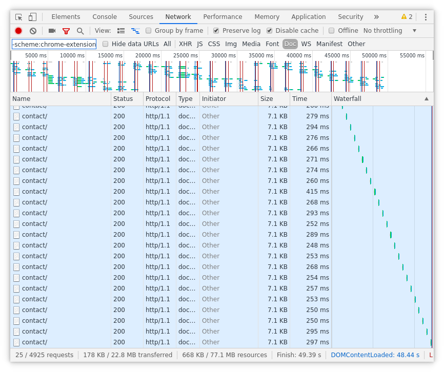

## Filesystems

I'm only going to talk about Linux filesystems here.

In general most people use ext4 for their Linux installations, because that is
the default in the biggest distributions. I personally have always been a fan
of xfs because I always was under the impression xfs has always been very fast
for the things I wanted to do. Another filesystem I very much like is btrfs
because of the features it provides, this can be controversial because there
are a lot of people who have had some negative experience with btrfs and
performance or sudden dataloss.

To test if the filesystem can have an impact on your overall containerized I'm
going to run some tests with the well known and famous Magento e-commerce
platform running locally using docker-compose.

The tests will be run in a VirtualBox VM representing the way I install my work
laptop. This means I will use full disk encryption and have my main filesystem
formatted as ext4, xfs and btrfs to see if I can spot differences in response
times when running a Magento demo shop on them.

<!-- more -->

## VM specs

- 4 CPU
- 6 Gb RAM
- Root disk with pre-allocated size of 30 Gb


## The tests

- time to install magento
- pageloads of homepage
- pageloads of contact page

## Results with ext4

### Install magento


### Pageload homepage

Initial pageload after install:


It takes us 21,93 seconds to finish the first load. Here we have to take into
account how magento works, all static content is generated in this first run.
So that makes it take a long time. This result is interesting for us because
the static content generation will generate a reasonable amount of disk I/O.

When everything is built up we see a better result:


This gives us 113ms to load the document and 1,69s to finish in the browser.

When we clean the magento cache and reload the homepage, a lot of Magento cache
and generated files must be recreated.


This results in a document load of 6,13s and a total load time of 7,22s.

One final test is to see if there is a lot of variation on the document loads
over several requests.


If we remove the outliers of 587ms and 847ms we get an average of 129ms.

### Pageload contact page

First pageload of the contact page (1st visit, homepage was already visited)


Here we get a load of 931ms and a finish in the browser of 1,88s.

Once again we clean the magento cache to see the impact on the contact page
this time.


On the contact page the cache clean results in a 6,13s load time with a total
finish of 6,70s.

The contact page is also tested to get an average document response time over
several requests.



Here we will remove the outlier of 415ms. Then we get an average document
response time of 269ms on the contact page.

## Results with xfs

### Install magento


### Pageload homepage

Initial pageload after install:


It takes us 28,59 seconds to finish the first load. Here we have to take into
account how magento works, all static content is generated in this first run.
So that makes it take a long time. This result is interesting for us because
the static content generation will generate a reasonable amount of disk I/O.

When everything is built up we see a better result:


This gives us 117ms to load the document and 1,72s to finish in the browser.

When we clean the magento cache and reload the homepage, a lot of Magento cache
and generated files must be recreated.


This results in a document load of 5,79s and a total load time of 6,91s.

One final test is to see if there is a lot of variation on the document loads
over several requests.


We can say 317ms is an outlier, so thisone will be removed. Now we get an
average of 124ms.

### Pageload contact page

First pageload of the contact page (1st visit, homepage was already visited)


Here we get a load of 1,03s and a finish in the browser of 1,56s.

Once again we clean the magento cache to see the impact on the contact page
this time.


On the contact page the cache clean results in a 6,27s load time with a total
finish of 6,96s.

The contact page is also tested to get an average document response time over
several requests.


Here we will remove the outlier of 499ms. Then we get an average document
response time of 270ms on the contact page.

## Results with btrfs

### Install magento


### Pageload homepage

Initial pageload after install:


It takes us 29,38 seconds to finish the first load. Here we have to take into
account how magento works, all static content is generated in this first run.
So that makes it take a long time. This result is interesting for us because
the static content generation will generate a reasonable amount of disk I/O.

When everything is built up we see a better result:


This gives us 118ms to load the document and 1,70s to finish in the browser.

When we clean the magento cache and reload the homepage, a lot of Magento cache
and generated files must be recreated.


This results in a document load of 6,84s and a total load time of 7,49s.

One final test is to see if there is a lot of variation on the document loads
over several requests.


We can say 238ms is an outlier, so thisone will be removed. Now we get an
average of 116ms.

### Pageload contact page

First pageload of the contact page (1st visit, homepage was already visited)


Here we get a load of 927ms and a finish in the browser of 1,45s.

Once again we clean the magento cache to see the impact on the contact page
this time.


On the contact page the cache clean results in a 6,41s load time with a total
finish of 7,00s.

The contact page is also tested to get an average document response time over
several requests.


Here we will remove the outlier of 530ms. Then we get an average document
response time of 270ms on the contact page.

## Comparison

### Installation

1m 20s on ext4
1m 08s on xfs
1m 29s on btrfs

So on this more I/O bound action we see that btrfs is the slowest and xfs is
fastest

### First load

16,25s domcontent ; 19,27s load ; 21,93s finish on ext4
23,26s domcontent ; 25,98s load ; 28,59s finish on xfs
23,56s domcontent ; 26,64s load ; 29,38s finish on btrfs

Here we see ext4 is a lot faster than xfs and btrfs

### Cache clean

6,13s document load on ext4
5,79s document load on xfs
6,24s document load on btrfs

Here we see similar results as when we were installing magento, that xfs is
faster and both ext4 and btrfs are somewhat slower

### Requests with warm cache

129ms avg on ext4
124ms avg on xfs
116ms avg on btrfs

When the caches are warm btrfs wins this one.

## Partial conclusion

I really wanted to stop here, I thought I would have a clear winner. But it
seems we only have a almost certain loser. Btrfs seems to be the slowest in all
small tests done yet. Only when the cache is warm it seems to be faster, which
is weird in a way.

## More tests then

So I came up with some additional tests, I'm going to import a fairly large
database a few times on every vm. And I will run a small test with dd to see
what that gives us as result.

## Import a db

``` sh
$ ls -alh dbdump.sql 
-rw-r--r-- 1 ike ike 3,4G mei 29 20:36 dbdump.sql
$ ls -alh dbdump.sql.gz 
-rw-r--r-- 1 ike ike 365M mei 29 20:36 dbdump.sql.gz
```

So a db of almost 3,5 gig. We will import it through a helper that takes stdin
as input.

``` sh
$ gunzip -c dbdump.sql.gz | mysqlimport db
```

### Import on ext4

1st run import


2nd run import


1st run was 26m59,62s and the second one was 30m24,13s.
On average we get 28m41,88s.

### Import on xfs

1st run import


2nd run import


1st run was 33m17,16s and the second one was 39m53,49s.
On average we get 36m35,33s.

### Import on btrfs

1st run import


2nd run import


1st run was 39m45,98s and the second one was 47m57,75s.
On average we get 43m51,86s.

### Concluding the import 'speed'

In both runs ext4 is faster with a relative large margin. Here xfs dissapoints
because it is a filesystem sugested for databases. There was no real surprise
that btrfs was slowest here.

If we take ext4 as 100%, xfs takes 127% of the time on the import and btrfs
takes 153% of the time. These are some big differences.

## Write a 1GiB file with zeroes using dd

``` sh
$ dd if=/dev/zero of=1GB.img bs=8M count=128
```

Once the intial file is created dd will go through the filesystem and we will
get the speed it can deliver.

### Write file on ext4


### Write file on xfs


### Write file on btrfs


### Concluding sequential write

Here we see btrfs is exceptionally fast (most of the time), sometimes its
exceptionally slow. xfs clearly beats ext4 overall. The clear win for btrfs
will be the result of the default compression I have enabled there. Lets add
another test.

## Write a 1GiB file with random data using dd

``` sh
$ dd if=/dev/urandom of=1GB.img bs=8M count=128
```

### Write file on ext4


### Write file on xfs


### Write file on btrfs


### Concluding sequential write

This write with random data shows that xfs is slightly ahead, with btrfs a
close second. ext4 is clearly slower in this case.

## Conclusion

Overal I would conclude btrfs is the slowest. And unless you are going to
import a lot of databases every day, xfs seems to be a bit faster than ext4.
But overall ext4 is probably still a great filesystem for default Linux
installations.
