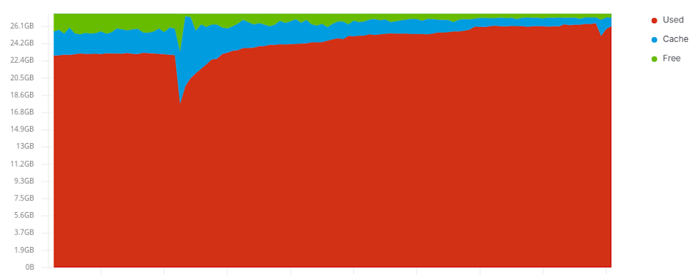
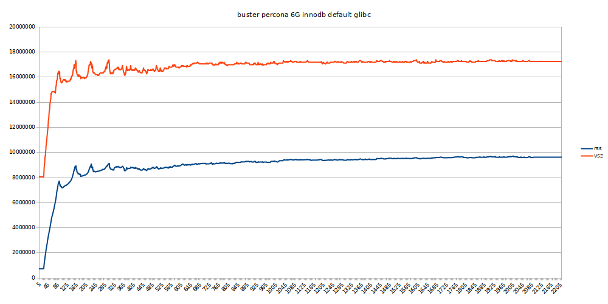
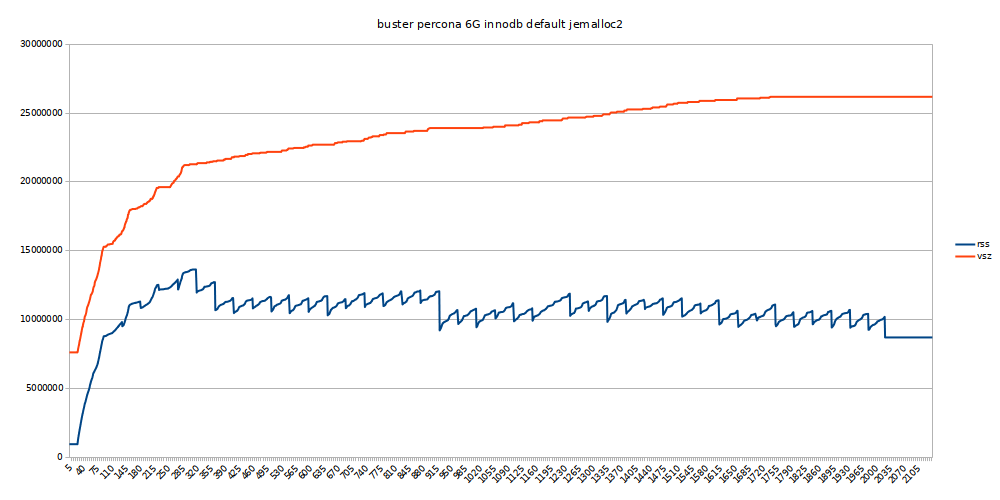
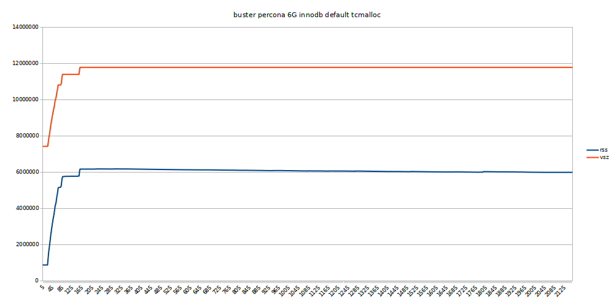
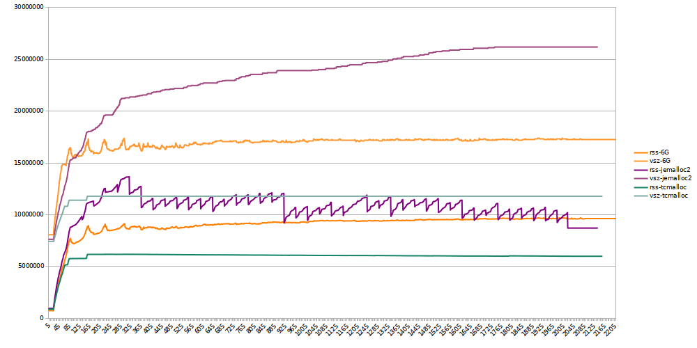

Recently we did some upgrades at work which were also updating the base OS. In
general we did not expect too many issues since we were running tests and the
operation of all parts was looking good.

After the upgrades we noticed something was off with mysql. Some mysql machines
were killing mysqld because of OOM (out-of-memory). You'll see the kills with
`journalctl` or in your `syslog`.

```
kernel: [1412367.803012] Killed process 98651 (mysqld) total-vm:61264768kB, anon-rss:25002552kB, file-rss:0kB, shmem-rss:0kB
kernel: [1412369.046959] oom_reaper: reaped process 98651 (mysqld), now anon-rss:0kB, file-rss:0kB, shmem-rss:0kB
```

Identifiable information is removed from the above lines.

Looking at the information we had we see after the upgrate we are using a lot
more memory. The following graph also shows this. (The time markers in the
graph are 12 hours appart, the dates are removed because they are not important
for this article). Ofcourse we also made sure mysqld was not getting killed
because we don't want corrupt mysql databases. We added `OOMScoreAdjust=-500`
to the mysql service (which was incorrectly set on the mysql.slice by me,
oops).



We did several things to mitigate issues due to the extra memory usage by
adding extra memory, spread some load we were generating, ...

But for the rest of the article we're going to focus on memory allocation
behaviour.

<!-- more -->

## Finding differences

This is not an easy task since we moved to a new base platform, new kernel, new
toolchain, new everything. So what is changed that would cause a big difference
in memory usage with the same mysql configuration. We're using mysql everywhere,
but we are using Percona mysql server.

Could it be the kernel? One of the mitigations for one of the many cpu issues?
Another config setting?

Was it somewhere in the toolchain somewhere? We think the way memory allocation
is done is the major cause of the higher memory usage we are seeing.

## Glibc

Before the change we had glibc 2.13 and after it we were using glibc 2.28. Big
step so potentially a lot of changes. Glibc is the default on our linux
distribution so that one will be used by default. Related to the big jump in
glibc version we found something interesting in the [mallopt man page][1]:

> This parameter has been available since glibc 2.10 via
> --enable-experimental-malloc, and since glibc 2.15 by default.

This would mean that we now have a different malloc implementation in our new
base platform compared to where we came from. This could already be an
indication why we see different memory usage behaviour.

## Alternative malloc implementations

Since we are using percona we searched on the percona blog and looked at their
way of setting up percona. They have a 2 part blog series about memory
allocators [part1][2] and [part2][3] explaining what the impact of a memory
allocator can be on the performance of mysql. Since these series it seems most
percona installations require the use of [jemalloc][4].

Another good alternative malloc is [tcmalloc][5]. Which is [created][6] by
google.

## What do we want in the results

Frist of all we want to see the overal memory usage and ofcourse we would like
to see if the overall speed is not impacted.

## The tests

### System and database information

Tests are run on a laptop in a docker container.

Some info of the machine running the test:

```
System Information
        Manufacturer: Dell Inc.
        Product Name: XPS 15 9570
Processor Information
        Family: Core i7
        Manufacturer: Intel(R) Corporation
        Version: Intel(R) Core(TM) i7-8750H CPU @ 2.20GHz
        Max Speed: 4100 MHz
Memory Device
        Size: 16384 MB
        Type: DDR4
        Speed: 2667 MT/s
Memory Device
        Size: 16384 MB
        Type: DDR4
        Speed: 2667 MT/s
Hard disk
       Model Number: PM981 NVMe Samsung 512GB
```

Relevant software information:

```
ii  percona-server-server-5.7        5.7.29.32-deb10+5           amd64        Percona Server database server binaries
ii  libc-bin                         2.28-10                     amd64        GNU C Library: Binaries
ii  libc-dev-bin                     2.28-10                     amd64        GNU C Library: Development binaries
ii  libc6:amd64                      2.28-10                     amd64        GNU C Library: Shared libraries
ii  libc6-dev:amd64                  2.28-10                     amd64        GNU C Library: Development Libraries and Header Files
ii  libjemalloc2:amd64               5.1.0-3                     amd64        general-purpose scalable concurrent malloc(3) implementation
ii  libtcmalloc-minimal4:amd64       2.7-1                       amd64        efficient thread-caching malloc
```

> Note: the percona build is custom but we have similar results with upstream
> builds running on CentOS.

The total size of the mysql data is 5,9GB and this holds 292 user created
databases. The data in these databases is not shareable with the world :).

### The test

> Due to the fact the tests were run on actual customer data we cannot share
> the queries we used to generate the results.

* Start mysqld
* when mysqld is started start logging rss and vsz in a csv file per second
* run idle for 20 seconds
* run a set of queries in parallell (the query execution time ranges from 0,03
  sec to 10,2 sec without load) 40 x 7 queries which are launced quickly, we
  reach between 130 to 140 connections simultanously.
* after that just run the same queries but in lower volume for a longer period
  of time.
* then 120 idle run to see if memory is being released
* end

Query scrpt without the actual queries:

``` sh
#!/usr/bin/env bash

QUERIES=(
    'query1'
    'query2'
    'SELECT table_schema as `Database`, table_name AS `Table`, round(((data_length + index_length) / 1024 / 1024), 2) `Size in MB` FROM information_schema.TABLES ORDER BY (data_length + index_length) DESC;'
    'SELECT table_schema as `Database`, table_name AS `Table`, round(((data_length + index_length) / 1024 / 1024), 2) `Size in MB` FROM information_schema.TABLES ORDER BY (data_length + index_length) ASC;'
    'query5'
    'query6'
    'query7'
)

function kickit() {
    for (( x=0; x<40; x++ )); do
        for query in "${QUERIES[@]}"; do
            (
            mysql -uroot -ptoor -e "$query" > /dev/null
            ) &
        done
        sleep 1
    done

    wait
}

function longtest() {
    for (( x=0; x<100; x++ )); do
        for (( y=0; y<10; y++ )); do
            for query in "${QUERIES[@]}"; do
                (
                mysql -uroot -ptoor -e "$query" > /dev/null
                ) &
            done
            sleep 1
        done

        wait
    done
}

kickit
kickit
kickit
kickit
longtest

```

The size in MB queries are there to have something kind of slow.

### The docker setup

To get jemalloc and tcmalloc and our custom percona build in an image we just
used the [mysql Dockerfile][7] as base and added our custom percona server and
tcmalloc because we want also test with that.

The docker compose file for our mysql server:

``` yaml
---
version: '3'

services:
  mysql:
    image: combell/buster-percona-server-5.7
    environment:
      - MYSQL_ROOT_PASSWORD=toor
      - DOMAIN_NAME=mysql.mysqltest.docker
    command: --max_allowed_packet=64M --innodb_buffer_pool_size=6G
    volumes:
      - "./mysql:/var/lib/mysql"
```

## Glibc memory test

``` yaml
---
version: '3'

services:
  mysql:
    image: combell/buster-percona-server-5.7
    environment:
      - MYSQL_ROOT_PASSWORD=toor
      - DOMAIN_NAME=mysql.mysqltest.docker
    command: --max_allowed_packet=64M --innodb_buffer_pool_size=6G
    volumes:
      - "./mysql:/var/lib/mysql"
```

The results can be found [here](./mysql-log-glibc.csv) in csv format.



The total runtime of this test was 2206 seconds. This we will use as the
baseline for our other tests.

We see some peaks when we are doing more queries, and if we keep doing queries
over a long time we see a continuous upward trend which flattens of over time.
Our virtual memory is a bit less than double of our resident memory usage.

## Jemalloc memory test

``` yaml
---
version: '3'

services:
  mysql:
    image: combell/buster-percona-server-5.7
    environment:
      - MYSQL_ROOT_PASSWORD=toor
      - DOMAIN_NAME=mysql.mysqltest.docker
      - LD_PRELOAD=/usr/lib/x86_64-linux-gnu/libjemalloc.so.2
    command: --max_allowed_packet=64M --innodb_buffer_pool_size=6G
    volumes:
      - "./mysql:/var/lib/mysql"
```

The results can be found [here](./mysql-log-jemalloc.csv) in csv format.



The total runtime of this test is 2136 seconds. So using jemalloc on mysql
gives us faster performance 👍.

We see our memory usage peaks fairly high if we have more queries. On the other
hand when the amount of queries goes down the memory is released quicker. We
also don't see a clearly steady upward trend which is nice. On the other hand
we see the steady upward trend in our virtual memory.

## Tcmalloc memory test

``` yaml
---
version: '3'

services:
  mysql:
    image: combell/buster-percona-server-5.7
    environment:
      - MYSQL_ROOT_PASSWORD=toor
      - DOMAIN_NAME=mysql.mysqltest.docker
      - LD_PRELOAD=/usr/lib/x86_64-linux-gnu/libtcmalloc_minimal.so.4
    command: --max_allowed_packet=64M --innodb_buffer_pool_size=6G
    volumes:
      - "./mysql:/var/lib/mysql"
```

The results can be found [here](./mysql-log-tcmalloc.csv) in csv format.



The total runtime of this test is 2154 seconds. So a bit slower than using
jemalloc but still faster than glibc 😃.

The memory usage is insanly stable, it rises to around our configured innodb
buffer pool size and just stays there. And the virtual memory usage is also a
little below double of the resident memory usage.

## All together



We see the memory usage is quite different between the separate malloc
implementations. 

## Conclusion

All combined we can draw the conclusion that in this test the tcmalloc is the
clear winner, since its performance is fairly good but it shines in its memory
usage being the lowest of the three, by far. Since we were searching for
something to reduce our memory usage we must subject mysql with tcmalloc to
real world database use and see if it holds up there. But its very promising.
For this test tcmalloc just wins.

[1]: http://man7.org/linux/man-pages/man3/mallopt.3.html
[2]: https://www.percona.com/blog/2012/07/05/impact-of-memory-allocators-on-mysql-performance/
[3]: https://www.percona.com/blog/2013/03/08/mysql-performance-impact-of-memory-allocators-part-2/
[4]: https://github.com/jemalloc/jemalloc
[5]: https://gperftools.github.io/gperftools/tcmalloc.html
[6]: https://github.com/google/tcmalloc
[7]: https://github.com/docker-library/mysql/blob/f7ba980b846fa5fd97423997e5ea0675600b185a/5.7/Dockerfile
