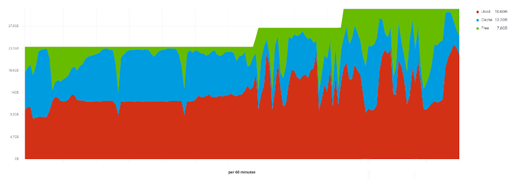
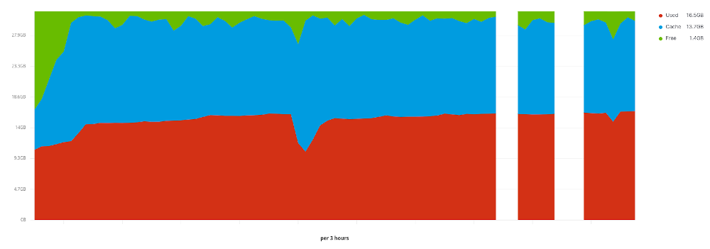
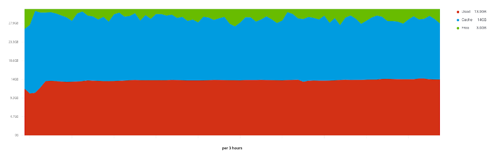

Following up on what was written about mysql / percona memory usage tests which
were basically [benchmarks on a local machine][1]. Do these results even hold
up with real production data and production usage?

<!-- more -->

Since we already had some issues where the memory consumption was very high, we
sort of jumped fast to use jemalloc since that was the preferred way of running
mysql. We alreay had experience with jemalloc for other workloads on mysql and
there we had good results.

## The production database

The stats of the database:

- 292 client databases
- smallest db 250 KiB on disk
- largest db 1 GiB on disk
- total db's size on disk 14 GiB

## Jemalloc in production

The use of jemalloc started out ok but then we started having serious peaks in
memory usage. These peaks were really high so we decided to move back to glibc.
The peaks were so high and unpredictable we could not keep on using jemalloc.

## Glibc in production

Since we added so much additional memory to this machine use of glibc was no
longer problematic. We see the similar trend as we see in the benchmarks that
we have a rising curve and then a steady grow of memory usage on the system.

## Tcmalloc in production

Once the backups have run we see we reached our memory usage and it stays
there. Using tcmalloc with mysql makes the memory usage so stable we almost
cannot believe it.

## Conclusion

In production the behaviour of jemalloc differed a lot from what we saw in the
benchmarks. This different behaviour is mostly related to our workload. With
other workloads we know for a fact that jemalloc is doing fine. Glibc has
practically the same trend as we have seen in the benchmark tests. And tcmalloc
really shines, whatever you throw at it, its memory consumption is extremely
stable. We can conclude tcmalloc is the clear winner for our workload and
usecase in combination with mysql.

[1]: https://blog.herecura.eu/blog/2020-04-23-mysql-memory-usage/
