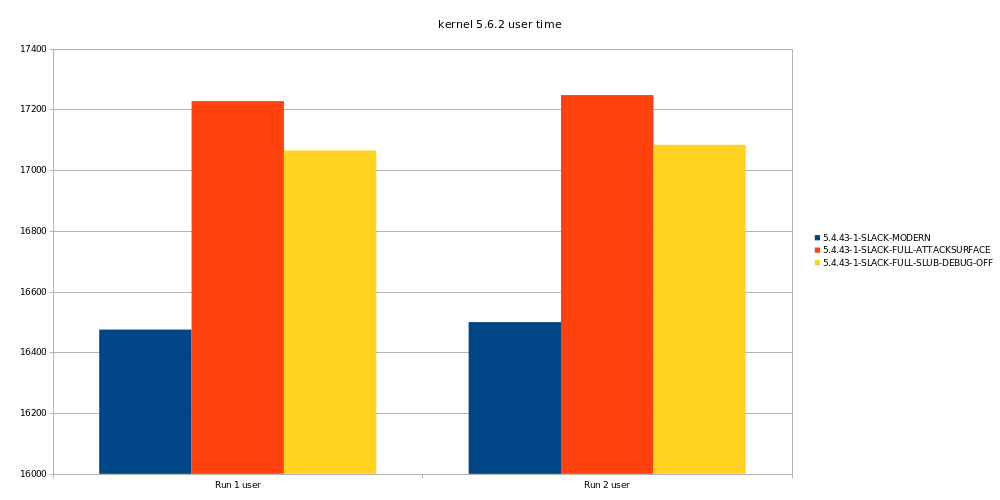

Ever since the repo "kconfig-hardening-check" appeared I was interested to
know what the potential impact was on performance when you apply all those
changes. You can find the repo on Alexander Popov's github:
[kconfig-hardening-check](https://github.com/a13xp0p0v/kconfig-hardened-check)

<!--more-->

## Suggestions from different sources

The "kconfig-hardening-check" project bundles suggestions from different
sources to reduce the kernels attack surface and improve its self
protection. There is stuff in there from the [Kernel Self Protection
Project](https://kernsec.org/wiki/index.php/Kernel_Self_Protection_Project),
[Grsecurity](https://grsecurity.net), [Clip OS](https://clip-os.org/en/),
[GrapheneOS](https://grapheneos.org/) and Alexander Popov.

## Base kernel

For this test we are going to use the slackware kernel config as base. This
because the Slackware kernel config will have the default settings
available, but probably not too many of the additional hardening config
changes.

## The Goal

We start with a reference config which is default ok, but does not have too
many additional hardening config settings set. The tool checks on 136 config
items in the Linux kernel configuration if they have a specific setting.
Because this is a lot, we will split this in groups.

### The default config

We start with the basic config, and from there we will add "groups" of kernel
hardening options and see what the impact is.

Based on this [default](./default.config) config we can define the groups of
config items we will use in our tests.

When we run `kconfig-hardened-check -c default.config` we get the following
result to start from. Full output [here](./default.kconfig-check.txt).

```
[+] config check is finished: 'OK' - 61 / 'FAIL' - 75
```

So There are still 75 "failures" to correct, we will change these in groups
because there are too many options to change and test individually. The
defconfig self protection is already ok, now the other parts.

### Group 1: KSPP Selfprotect

We are going to set the following config settings:

```
CONFIG_SLAB_FREELIST_RANDOM=y
CONFIG_SLAB_FREELIST_HARDENED=y
CONFIG_SHUFFLE_PAGE_ALLOCATOR=y
CONFIG_GCC_PLUGIN_LATENT_ENTROPY=y
CONFIG_GCC_PLUGIN_RANDSTRUCT=y
# CONFIG_GCC_PLUGIN_RANDSTRUCT_PERFORMANCE is not set
CONFIG_MODULE_SIG_FORMAT=y
CONFIG_MODULE_SIG=y
CONFIG_MODULE_SIG_FORCE=y
CONFIG_MODULE_SIG_ALL=y
# CONFIG_MODULE_SIG_SHA1 is not set
# CONFIG_MODULE_SIG_SHA224 is not set
# CONFIG_MODULE_SIG_SHA256 is not set
# CONFIG_MODULE_SIG_SHA384 is not set
CONFIG_MODULE_SIG_SHA512=y
CONFIG_MODULE_SIG_HASH="sha512"
CONFIG_DEFAULT_MMAP_MIN_ADDR=65536
CONFIG_HARDENED_USERCOPY=y
# CONFIG_HARDENED_USERCOPY_FALLBACK is not set
# CONFIG_HARDENED_USERCOPY_PAGESPAN is not set
CONFIG_FORTIFY_SOURCE=y
CONFIG_GCC_PLUGIN_STACKLEAK=y
CONFIG_INIT_ON_ALLOC_DEFAULT_ON=y
CONFIG_INIT_ON_FREE_DEFAULT_ON=y
CONFIG_MODULE_SIG_KEY="certs/signing_key.pem"
CONFIG_SCHED_STACK_END_CHECK=y
CONFIG_DEBUG_LIST=y
CONFIG_DEBUG_SG=y
CONFIG_DEBUG_NOTIFIERS=y
CONFIG_DEBUG_CREDENTIALS=y
CONFIG_BUG_ON_DATA_CORRUPTION=y
CONFIG_DEBUG_WX=y
```

### Group 2: CLIPOS and Alexander Selfprotect

We are going to set the following config settings:

```
# CONFIG_SLAB_MERGE_DEFAULT is not set
CONFIG_RESET_ATTACK_MITIGATION=y
# CONFIG_GCC_PLUGIN_RANDSTRUCT_PERFORMANCE is not set
# CONFIG_RANDOM_TRUST_CPU is not set
# CONFIG_RANDOM_TRUST_BOOTLOADER is not set
CONFIG_AMD_IOMMU_V2=y
CONFIG_INTEL_IOMMU_SVM=y
CONFIG_INTEL_IOMMU_DEFAULT_ON=y
CONFIG_SECURITY_DMESG_RESTRICT=y
# CONFIG_STATIC_USERMODEHELPER is not set
# CONFIG_STACKLEAK_METRICS is not set
# CONFIG_STACKLEAK_RUNTIME_DISABLE is not set
CONFIG_SLUB_DEBUG_ON=y
CONFIG_DEBUG_VIRTUAL=y
```

The tool also suggests `CONFIG_STATIC_USERMODEHELPER=y` but we don't have a
usermode helper so we're leaving this out.

### Group 3: Userspace Hardening

The default config suggested is already ok so we only going to add the clipos
suggestion here:

```
CONFIG_ARCH_MMAP_RND_BITS=32
```

### Group 4: KSPP cut Attack Surface

Here we are going to change the config until we reach the following:

```
# CONFIG_COMPAT_BRK is not set
# CONFIG_KEXEC is not set
# CONFIG_KEXEC_FILE is not set
CONFIG_LEGACY_VSYSCALL_NONE=y
# CONFIG_MODIFY_LDT_SYSCALL is not set
# CONFIG_HIBERNATION is not set
# CONFIG_IA32_EMULATION is not set
# CONFIG_X86_X32 is not set
CONFIG_MODULES_USE_ELF_RELA=y
CONFIG_MODULES=y
CONFIG_MODULES_TREE_LOOKUP=y
# CONFIG_BINFMT_MISC is not set
# CONFIG_INET_DIAG is not set
# CONFIG_LEGACY_PTYS is not set
# CONFIG_DEVMEM is not set
# CONFIG_DEVKMEM is not set
# CONFIG_PROC_KCORE is not set
```

Here we are going to skip the disabling of the modules. Here we are assuming
setting `# CONFIG_MODULES is not set` will have a big impact on the
configuration time and will be mostly usefull if you already are able to
compile a kernel for a specific target.

### Group 5: CLIPOS cut Attack Surface

The changes we will do here are:

```
# CONFIG_USER_NS is not set
# CONFIG_KALLSYMS is not set
# CONFIG_X86_VSYSCALL_EMULATION is not set
# CONFIG_X86_MSR is not set
# CONFIG_X86_CPUID is not set
CONFIG_X86_INTEL_TSX_MODE_OFF=y
# CONFIG_KEXEC_FILE is not set
# CONFIG_KSM is not set
# CONFIG_LDISC_AUTOLOAD is not set
# CONFIG_STAGING is not set
# CONFIG_MAGIC_SYSRQ is not set
```

### Group 6: GRSEC cut Attack Surface

The grsec (grsecurity) settings we are going to apply:

```
# CONFIG_USELIB is not set
# CONFIG_CHECKPOINT_RESTORE is not set
# CONFIG_USERFAULTFD is not set
# CONFIG_KPROBES is not set
# CONFIG_HWPOISON_INJECT is not set
# CONFIG_ZSMALLOC_STAT is not set
# CONFIG_DEVPORT is not set
# CONFIG_PROC_VMCORE is not set
# CONFIG_PROC_PAGE_MONITOR is not set
# CONFIG_DEBUG_FS is not set
# CONFIG_PAGE_OWNER is not set
# CONFIG_DEBUG_KMEMLEAK is not set
# CONFIG_NOTIFIER_ERROR_INJECTION is not set
CONFIG_X86_PTDUMP_CORE=y
# CONFIG_X86_PTDUMP is not set
```

### Group 7: Security Policy

In the security policy we are going to set the following. But we will skip a
few settings that are harder to achieve easy on my test machine.

```
CONFIG_SECURITY=y
# CONFIG_SECURITY_LOADPIN is not set
CONFIG_SECURITY_YAMA=y
CONFIG_SECURITY_SAFESETID=y
CONFIG_SECURITY_LOCKDOWN_LSM=y
CONFIG_SECURITY_LOCKDOWN_LSM_EARLY=y
CONFIG_LOCK_DOWN_KERNEL_FORCE_CONFIDENTIALITY=y
```

Because the modules are not all on the same filesystem, part of those are in
the initramfs in the separate boot partition, the rest is in the root
filesystem. So `CONFIG_SECURITY_LOADPIN=y` and
`CONFIG_SECURITY_LOADPIN_ENFORCE=y` we will not enable here even though the
tool suggests it.

### Group 8: GrapheneOS and Alexander's cut Attack Surface

Here we can enable these settings:

```
# CONFIG_AIO is not set
# CONFIG_IP_DCCP is not set
# CONFIG_IP_SCTP is not set
# CONFIG_BPF_JIT is not set
# CONFIG_INPUT_EVBUG is not set
CONFIG_VT=y
# CONFIG_VIDEO_VIVID is not set
# CONFIG_DRM_LEGACY is not set
CONFIG_FB=y
# CONFIG_FTRACE is not set
```

We are not ging to disable `CONFIG_VT` and `CONFG_FB`. We must still be able to
login via tty on this laptop to be able to run the test.

## The system used for the test

Some info of the machine running the test:

```
System Information
        Manufacturer: TUXEDO
        Product Name: N8xxEZ
Processor Information
        Family: Core i7
        Manufacturer: Intel(R) Corporation
        Version: Intel(R) Core(TM) i7-8750H CPU @ 2.20GHz
        Max Speed: 4100 MHz
Memory Device
        Size: 16384 MB
        Type: DDR4
        Speed: 2667 MT/s
Memory Device
        Size: 16384 MB
        Type: DDR4
        Speed: 2667 MT/s
Hard disk
       Model Number: Samsung SSD 970 EVO 500GB
```

## The test

To compare the performance impact of the changes we will do 2 runs compiling
the 3.6.2 kernel. The configuration is not relevant for this test, its just to
have a test that is basically cpu bound and takes a while.

The exact configuration / setup for the 3.6.2 kernel can be found on my
[linux-bede github](https://github.com/herecura/linux-bede/tree/87c28bc05b069fc32bb2781d4d0db48948096e56).

The tests are run as follows:

- idle 300 sec
- time the build
- idle 300 sec
- time the build

`testrun.sh`:

``` sh
#!/usr/bin/env bash

sleep 300
./referencetimer.sh
sleep 300
./referencetimer.sh
```

`referencetimer.sh`:

``` sh
#!/usr/bin/env bash

kernel="$(uname -a)"
kernelrelease="$(uname -r)"
starttime="$(date "+%Y%m%d%H%M%S")"

time (
echo "$kernel"
echo "$starttime"
rm -r *.pkg.tar.*
rm -rf pkg src
makepkg
) >> "$kernelrelease-$starttime.txt" 2>&1
```

## Configs and kconfig-hardened-checks

- default: 5.4.30-1-SLACK-MODERN
- kspp self protection: 5.4.30-1-SLACK-KSSP-SELFPROTECT
- kspp clipos and other self protection: 5.4.30-1-SLACK-SELFPROTECT-EXTRA
- userspace hardening: 5.4.30-1-SLACK-USERSPACE
- kspp cut attack surface: 5.4.30-1-SLACK-KSPP-ATTACSURFACE
- clipos cut attack surface: 5.4.30-1-SLACK-CLIPOS-ATTACKSURFACE
- grsec cut attack surface: 5.4.30-1-SLACK-GRSEC-ATTACKSURFACE
- security policy changes: 5.4.30-1-SLACK-SECURITY-POLICY
- maximum enabled self protection: 5.4.30-1-SLACK-FULL-ATTACKSURFACE

| kernelname | kernel config | kconfig hardened check |
| --- | --- | --- |
| 5.4.30-1-SLACK-MODERN | [config](./default.config) | [hardened-check](./default.kconfig-check.txt) |
| 5.4.30-1-SLACK-KSSP-SELFPROTECT | [config](./01_kspp-selfprotect.confg) | [hardened-check](./01_kspp-selfprotect.kconfig-check.txt) |
| 5.4.30-1-SLACK-SELFPROTECT-EXTRA | [config](./02_selfprotect-extra.config) | [hardened-check](./02_selfprotect-extra.kconfig-check.txt) |
| 5.4.30-1-SLACK-USERSPACE | [config](./03_userspace.config) | [hardened-check](./03_userspace.kconfig-check.txt) |
| 5.4.30-1-SLACK-KSPP-ATTACSURFACE | [config](./04_kspp-attacksurface.config) | [hardened-check](./04_kspp-attacksurface.kconfig-check.txt) |
| 5.4.30-1-SLACK-CLIPOS-ATTACKSURFACE | [config](./05_clipos-attacksurface.config) | [hardened-check](./05_clipos-attacksurface.kconfig-check.txt) |
| 5.4.30-1-SLACK-GRSEC-ATTACKSURFACE | [config](./06_grsec-attacksurface.config) | [hardened-check](./06_grsec-attacksurface.kconfig-check.txt) |
| 5.4.30-1-SLACK-SECURITY-POLICY | [config](./07_security-policy.config) | [hardened-check](./07_security-policy.kconfig-check.txt) |
| 5.4.30-1-SLACK-FULL-ATTACKSURFACE | [config](./08_full.config) | [hardened-check](./08_full.kconfig-check.txt) |

## Results

The results are combined in a [spreadsheet](./kconfig-hardening-tests.ods).

If we look at the total time for the compilation we see a quick rise in
compilation time. Then some stagnation and when enabling the last groups a
little bit of a rise again.


When we look at the time in userland we see a quick rise in the beginning. Then
there is some stagnation, but when enabling the last group (GrapheneOS and
Alexander's cut Attack Surface) there is a massive increase of time.


The time spent in system, massively rises when group 2 (CLIPOS and Alexander Selfprotect) is enabled and then
stays about the same for the rest of the groups.


When we look at this overall, the biggest increase in compilation time of the
2.6.2 kernel comes in group 2 (CLIPOS and Alexander Selfprotect). Since we now
worked in groups of settings we can't yet pinpoint if the enabling of a group
of settings is the cause of this huge increase, or if there is only one or two
settings causing this big increase of time.

If we look at the difference between the base kernel and the most hardened
kernel we add ~ 13,5% to the compilation time of linux 2.6.2. This is a very
high percentage in terms of performance loss.

## One setting counts for almost 10%

At some point there was a need to rebuild some kernels and almost by accident
it showed a huge performance difference. When researching the one setting that
seemed to be different was `CONFIG_SLUB_DEBUG_ON=y`. So over a month after the
first batch of tests a new test was run. We will now update to the latest 5.4
kernel at the moment, being 5.4.43 and rerun the tests for the base kernel, the
fully proteced kernel and then as extra fully protected but
`CONFIG_SLUB_DEBUG_ON` disabled.

| kernelname | kernel config | kconfig hardened check |
| --- | --- | --- |
| 5.4.43-1-SLACK-MODERN | [config](./09_default.config) | [hardened-check](./09_default.kconfig-check.txt) |
| 5.4.43-1-SLACK-FULL-ATTACKSURFACE | [config](./10_full.config) | [hardened-check](./10_full.kconfig-check.txt) |
| 5.4.43-1-SLACK-FULL-SLUB-DEBUG-OFF | [config](./11_full_slub_debug_off.config) | [hardened-check](./11_full_slub_debug_off.kconfig-check.txt) |

If we look at the total difference, the actual time spent to compile the same
other kernel as in the previous tests, we see the same around 13% extra time
needed between the base and the fully protected version. But if we only disable
`CONFIG_SLUB_DEBUG_ON` the difference is only around 4%. So overall this one
setting loses us almost 10% which is huge.


If we look further this one setting mostly costs us deerly in the system time.


And there is little gain in user time.



The results can be compared in this [spreadheet](./slub-debug-off.ods).

## Conclusion

As usual additional security is not free, but we can apply a lot of kernel
hardening tips without a huge loss in performance, since we discovered the
biggest loss is due to *one* config setting namely `CONFIG_SLUB_DEBUG_ON`. If
we omit this one setting we lose overall around 4% which might be very
acceptable if you want this additional kernel hardening.
