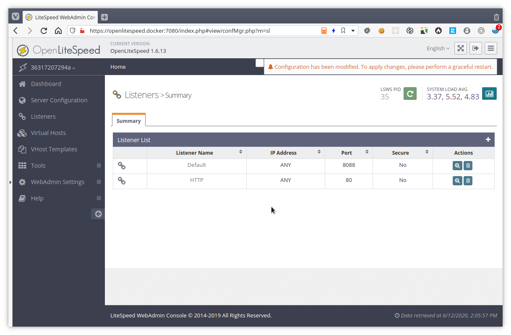
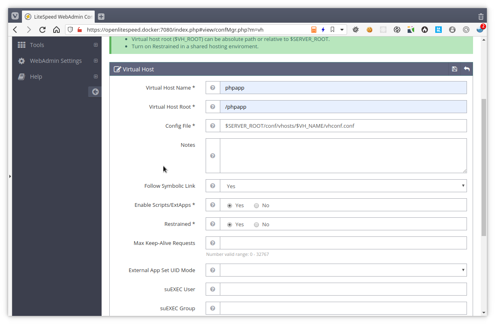

Since we all get used to use one piece of software, Lets stir up the pot. We
are mostly using nginx and apache httpd for webserver. But there is a
replacement for apache httpd which supports `.htaccess` files, meaning we can
switch very easily to it, called OpenLitesSpeed. [OpenLiteSpeed][1] is the free
and Open Source "counterpart" of the LiteSpeed server by [litespeedtech][2]. It
claims to be faster than Nginx and Apache httpd. And as an extra, it can handle
`.htaccess` files, so many applications will work just out-of-the-box.

<!-- more -->

## What?

> Event driven processes, less overhead, more connections, and enormous
> scalability, with no hardware upgrade required!

> Add the popular LiteSpeed Cache for WordPress plugin, and you get a 100% open
> source, accelerated hosting platform for WordPress.

So it should be faster than what we usually have and we can keep on using our
beloved `.htaccess` files to do some fancy stuff.

The enterprise version [LiteSpeed][3] can even work with your Apache httpd
config, which is truely awesome.

The really well integrated mod_security and GeoIP modules are a very good
selling point here, because we will need those anyway. So it being built-in is
super nice.

## It has an admin interface

This is actually really nice to have an admin interface with your webserver. By
default you can access the admin by browsing to
`https://openlitespeed.docker:7080`, or another domain where you are running
OpenLiteSpeed. The default installation comes with self signed certificates
which is not an issue while toying around.

We can control the webserver completely from the admin. So for people liking a
gui better, this is really nice.

## Example vhost

The default vhost we can find on `http://openlitespeed.docker:8088`.

We get some nice examples of some of the capabilities to learn how to use this
webserver.

For example here we have basic php and a custom error page.

## Configuration

Creating a new vhost can be done completely from the admin interface. We will
need some time to get used to this, because some things are split up
differently than what we are used to. For example there is the concept
`Listener`, where we can define the port and if it's secure (SSL). And then we
can attach vhosts to that listener. Where for Apache httpd or nginx we are used
to just define the port(s) we are listening on in the vhost configuration.

For example, we add the HTTP listener and add the Example vhost to it:

We go to the listeners and going to create a new listener by clicking the plus
sign.

We fill in our configuration and can even pin this listener to a specific cpu
core if we want.

Now we have a new HTTP listener. We already get an indication we will have to
reload the webserver since we have done configuration changes, but we will not
yet reload.

We'll click the magnifying glass to see the listener. Here we can add vhosts to
this specific listener. We can attach the same vhost to different listeners
because we will not remove the Example vhost from the default listener (on port
8088).

Adding our vhost on all domainnames now.

We have our vhost attached and will now gracefully reload the webserver by
clicking the green button with the circle arrow.

When we now browse to `http://openlitespeed.docker/`, we get the example page.

So now we also want to create a new vhost. We already have a index.html and
index.php lined up in `/phpapp/pub`. So lets find out how hard this will be to
add.

Now we will add a `phpapp` vhost which can be found in `/phpapp`.

We have our vhost, but even though there is already a notification we will need
to restart the server we will first continue our configuration.

In the "General" tab of the vhost detail we must configure our Document root
and if we want compresion and such.

To have it easily available we'll just remove the example vhost from the HTTP
listener and add our new phpapp vhost listening to all domains.

Our great index page:

And the phpinfo:

So all in all this is relatively straight forward to get things working with
this server.

## Conclusion

OpenLiteSpeed definitly looks like a nice and great webserver too look at and
play with. How it compares performance wise versus the more defacto webservers
is a question for another time. It is great to have an admin panel on board
with the webserver, from the admin configuring a website is certainly not
really hard so thats a plus. When we go and look in the configuration files we
might wonder how to automate this because the main httpd_conf.conf file is
being modified to add a new vhost, or if the information for a listener is
changed. So that might be a drawback here, not so easy to manipulate directly
from the config files as what we are used to when using Apache httpd or nginx.

[1]: https://openlitespeed.org/
[2]: https://www.litespeedtech.com
[3]: https://www.litespeedtech.com/products/litespeed-web-server
