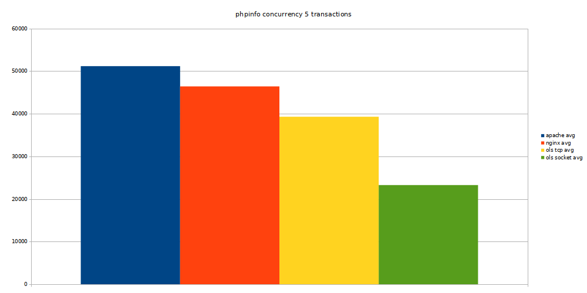

OpenLiteSpeed looks like a nice and fancy webserver, but how does it compare in
terms of performance to the webservers we usually use. We are mostly interested
in how it compares to Apache httpd and Nginx.

<!--more-->

## Goals

- compare static file serving
- compare phpinfo
- compare a real world application

## Setup's

We will have 3 setups which do TCP between the webserver and PHP, and one where
we will let OpenLiteSpeed manage it's own lsphp to see how that behaves.

### Nginx

- nginx 1.18.0
- php-fpm 7.3.18 (5 children)
- redis 6.0.4
- mysql 5.7.30

### Apache

- apache httpd 2.4.43
- php-fpm 7.3.18 (5 children)
- redis 6.0.4
- mysql 5.7.30

### OpenLitesSpeed (tcp)

- openlitespeed 1.6.13
- lsphp 7.3.17 (via tcp) (25 children)
- redis 6.0.4
- mysql 5.7.30

### OpenLitesSpeed (sock)

- openlitespeed 1.6.13
- lsphp 7.3.17 (managed by openlitespeed) (25 connections, 25 children)
- redis 6.0.4
- mysql 5.7.30

Here we also change the lsphp children to 25 from the default 10.

### PHP application Magento 2

We will use Magento 2 2.3.5-p1 for testing the webserver <-> php performance.
This is a default installation + sampledata. We already have the credentials to
use `repo.magento.com` in `~/.composer/auth.json`.

```sh
$ cd magento
$ composer create-project \
    --repository=https://repo.magento.com/ \
    magento/project-community-edition .
$ bin/magento setup:install -vvv --db-host=mysql --db-name=magento2 \
    --db-user=root --db-password=toor --backend-frontname=admin \
    --base-url=http://magento.docker \
    --language=nl_BE --currency=EUR --timezone=Europe/Brussels \
    --admin-lastname=dockerwest --admin-firstname=dockerwest \
    --admin-email=dockerwest@example.com \
    --admin-user=admin --admin-password=DockerWest123! \
    --use-secure=0 --use-rewrites=1 --use-secure-admin=0 \
    --use-sample-data \
    --session-save=redis --session-save-redis-host=redis \
    --session-save-redis-db=0 \
    --cache-backend=redis --cache-backend-redis-server=redis \
    --cache-backend-redis-db=1 \
    --page-cache=redis --page-cache-redis-server=redis \
    --page-cache-redis-db=2 --page-cache-redis-compress-data=1
$ bin/magento sampledata:deploy
$ bin/magento setup:upgrade
```


## System information

Tests are run on a laptop with docker-compose stacks.

Some info of the machine running the test:

```
System Information
        Manufacturer: Dell Inc.
        Product Name: XPS 15 9570
Processor Information
        Family: Core i7
        Manufacturer: Intel(R) Corporation
        Version: Intel(R) Core(TM) i7-8750H CPU @ 2.20GHz
        Max Speed: 4100 MHz
Memory Device
        Size: 16384 MB
        Type: DDR4
        Speed: 2667 MT/s
Memory Device
        Size: 16384 MB
        Type: DDR4
        Speed: 2667 MT/s
Hard disk
       Model Number: PM981 NVMe Samsung 512GB
```

## The tests

### The method

We will use [siege][1] to run our tests. We will be using
[this default configuration](./siegerc). We will also record the cpu and
memory usage with [psrecord][2] to see if there is a lot of difference to be
seen there.

We will warmup both php and the webserver by doing the requests for 20 seconds.
Then we will always record 80 seconds of cpu and memory usage, 10 seconds idle
time, 60 seconds test and again 10 seconds idle time.

For example:

```sh
#!/usr/bin/env bash

test_name="magento-warmup"
web_server="openlitespeed"
log_date="$(date +%Y%m%d%H%M%S)"
pid_openlitespeed="$(pgrep litespeed | head -n1)"
pid_lsphp="$(pgrep lsphp | head -n1)"

psrecord --log "$web_server-$test_name.psrecweb.$log_date.log" \
    --include-children --interval 1 --duration 80 "$pid_openlitespeed" &
psrecord --log "$web_server-$test_name.psrecphp.$log_date.log" \
    --include-children --interval 1 --duration 80 "$pid_lsphp" &

sleep 10
siege -c1 -t 60s -f urls-openlitespeed.txt \
    > "$(pwd)/$web_server-$test_name.siege.$log_date.log" 2>&1
sleep 10
```

All runs will be done 3 times to be sure, and the averages will be used for
graphs and conclusions.

All docker-compose setups will be congfigured in a similar fashion as the
[DockerWest compose-magento][3] configuration. We will exclude elasticsearch
and if needed build custom images where needed - being, openlitespeed, apache,
lshp.

### phpinfo test

We will modify the `index.php` file so it only has `phpinfo();`.

We'll just siege with concurrency 5:

```sh
siege -c5 --no-parser -t 60s http://magento.docker/ \
    > "$(pwd)/phpinfo.$(date +%Y%m%d%H%M%S).log" 2>&1
```

When we look at the number of transactions we can do, Apache httpd can do the
most, and if we let OpenLitesSpeed manage php it comes as last.



To give us the most requests in 60s Apache httpd also uses most cpu.


In terms of memory usage, both OpenLitesSpeed tests use about twice as much
memory compared to Apache httpd and Nginx.


Cpu usage for both php-fpm tests and the lsphp managed by OpenLitesSpeed are
similar. Here we see the lsphp via tcp using a lot more cpu than the others.


The PHP memory usage has a big difference, where both php-fpm instances use 120
to 140MB ram. But the lsphp instances easily go to 600MB which is a huge
difference.


For the phpinfo test we can say that Apache httpd wins, with most cpu usage.
Nginx is very similar with somwhat less cpu usage. OpenLitesSpeed does not
really perform that well in this test, especially the huge memory footprint to
handle the requests is a drawback here.

### static files test

We select 5 images we will get with a concurrency of 15 for 60 seconds.

We will use the following urls:

```
BASE=http://magento.docker
${BASE}/media/wysiwyg/home/home-pants.jpg
${BASE}/media/wysiwyg/home/home-erin.jpg
${BASE}/media/wysiwyg/home/home-main.jpg
${BASE}/media/wysiwyg/home/home-eco.jpg
${BASE}/media/wysiwyg/home/home-t-shirts.png
```

And run siege as follows:

```sh
siege -c15 -t 60s -f urls-static.txt \
    > "$(pwd)/magento-static.$(date +%Y%m%d%H%M%S).log" 2>&1
```

In this test we find Apache httpd to be very slow compared to the others.
OpenLitesSpeed scores a landslide win here. Both times OpenLitesSpeed serves
more than 1 milion transactions in 60s. OpenLitesSpeed does over 100000
transactions more than Nginx.


At first we see Apache httpd using a lot of cpu which suddenly drops back. It
shows the same behaviour in 3 separate runs which might indicate both siege and
Apache httpd are hungry for cpu and siege starts winning after 30s of the
siege. OpenLitesSpeed goes to around 250% cpu and Nginx stays just below 200%
cpu.


Here we can see again that OpenLitesSpeed uses around double the memory
compared to Apache httpd and Nginx. We can't say 80MB is a lot but compared to
around 40MB its a lot more.


We can conclude here that OpenLitesSpeed is really good at serving static
files. And it does it really fast. Nginx also does a good job, but more than
100000 transactions is a big difference. From the graphs we can conclude Apache
httpd was starved out of cpu by siege and therefore did not manage to do as
many transactions.

### magento test with static files ("normal browsing")

We'll do 2 runs here, one where the concurrency is 1 as if we are doing a
single user reference run. Then a normal run with concurrency 15.

The following urls will be used:

```
BASE=http://magento.docker
${BASE}/what-is-new.html
${BASE}/women.html
${BASE}/men.html
${BASE}/gear.html
${BASE}/training.html
${BASE}/sale.html
${BASE}/catalogsearch/result/?q=hoodie
${BASE}/customer/account/login
${BASE}/contact/
${BASE}/catalogsearch/advanced/
${BASE}/privacy-policy-cookie-restriction-mode
${BASE}/customer/account/create/
${BASE}/women/tops-women/hoodies-and-sweatshirts-women.html
${BASE}/men/tops-men/hoodies-and-sweatshirts-men.html
${BASE}/catalogsearch/result/?q=bag
${BASE}/tiffany-fitness-tee.html
${BASE}/adrienne-trek-jacket.html
${BASE}/zoltan-gym-tee.html
${BASE}/taurus-elements-shell.html
${BASE}/luma-analog-watch.html
```

Since siege is running with the parser on the static files like css, js and
images are also loaded.

First we will run the "warmup" as shown below:

```sh
siege -c1 -t 60s -f urls.txt \
    > "$(pwd)/magento-warmup.$(date +%Y%m%d%H%M%S).log" 2>&1
```

When we do one concurrent process on a magento demo site. We see we can hanle
most requests with OpenLitesSpeed with lsphp over tcp. Which feels a bit
strange, we would expect a better result when using a socket.


We see OpenLitesSpeed with lsphp over tcp and Nginx come out as the ones with
the shortest long transaction. This is not really huge because we are talking
about 0.02 seconds in this case.


Apache httpd is again the webserver that uses mose cpu and both OpenLitesSpeed
setups are doing very good in that department.


As we have seen before, OpenLitesSpeed uses more memory.


In comparison lsphp uses more cpu than the php-fpm counterparts. It's not very
much but with concurrency this could have an impact.


Memory wise we see a huge difference between lsphp and fpm. The lsphp started
by OpenLitesSpeed itself uses more than 1GB of memory compared to around 200MB
for the php-fpm instances.


Second browsing run is one with concurrency 15:

```sh
siege -c15 -t 60s -f urls.txt \
    > "$(pwd)/magento.$(date +%Y%m%d%H%M%S).log" 2>&1
```

Again we see that OpenLitesSpeed with lsphp over TCP does most transactions.
The somewhat strange part is that we would have expected that the lsphp managed
by OpenLitesSpeed would perform similar. This did not happen. OpenLitesSpeed
managing lsphp has the least amout of transactions when the concurrency rises
to 15.


Even more strange is the fact that OpenLitesSpeed with lsphp over the socket
has te lowest long transaction, but we saw that it has the least amount of
transactions. Compared to OpenLitesSpeed with lsphp over TCP which has the
longest long transaction and still does most transactions compared to the rest.


We see that OpenLitesSpeed really handles itself very well cpu wise when the
concurrency becomes higher. Nginx and Apache httpd use 3 to almost 4 times as
much cpu.


The memory usage rises a bit on OpenLitesSpeed but not really significant. So
the comparison stays practically the same as in the other tests, almost double
memory usage compared to Apache httpd and Nginx.


Both php-fpm and the lsphp over the socket use about the same amount of cpu,
but the lsphp over TCP uses almost twice the amount of cpu.


The memory usage of lsphp is insanely higher compared to both php-fpm
instances.


So for mixed static and php hits we see the results of OpenLitesSpeed with
lsphp over socket are really bad. Since the results were actually pretty good
with concurrency 1 you could say it can't handle concurrency very well. But on
the other hand OpenLitesSpeed with lsphp over tcp works really well. The
biggest drawback at the moment is the very high memory usage by lsphp compared
to php-fpm.

### magento test without static files

And finally we will run a webserver -> php test only where we disable the
parser of siege and only hit the urls going to php.

```sh
siege --no-parser -c15 -t 60s -f urls.txt \
    > "$(pwd)/magento-noparser.$(date +%Y%m%d%H%M%S).log" 2>&1
```

Again we see similar results in this test. OpenLitesSpeed with lsphp over TCP
scores most transactions and the other OpenLitesSpeed setup seems really slow.


Now the OpenLitesSpeed setup with lsphp over socket has an insanely high
longest transaction. Where the other OpenLitesSpeed setup has a much longer
transaction compared to Apache httpd or Nginx.


The instance with least transactions uses least cpu. The strange spikes are
probably because the cpu measurement of the coupled lsphp instance was not
completely in sync with the OpenLitesSpeed cpu usage. And since we are
measuring with children, in the socket setup lsphp is a child of OpenLitesSpeed
so we have to extract the lsphp cpu usage from the OpenLitesSpeed total to get
wat OpenLitesSpeed is actually using.


Same figures in the memory usage as we have seen before.


For PHP we see similar results as before cpu and memory wise. Except that the
lsphp via socket does not seem to be doing much.


Based on these results we should add another test where we reduce the
concurrency to 5 to see how it behaves. Maybe the load was too high and the
lsphp via socket does not get started properly. This we should be able to see
if the concurrency is lower if the results become better.

### additional magento test without static files with reduced concurrency

```sh
siege --no-parser -c5 -t 60s -f urls.txt \
    > "$(pwd)/magento-noparser.$(date +%Y%m%d%H%M%S).log" 2>&1
```

When we reduce the concurrency we see that OpenLitesSpeed is significantly
faster. It can handle a lot more transactions compared to the traditional
setups we have.


One thing we see here there is a big differnce between te longest transaction
in both OpenLitesSpeed setups.


If we reduce the amount of concurrenct connections, and by that reducing the
overal load on the system, we see that all webservers have around the same
amount of cpu usage to handle the requests.


And again OpenLitesSpeed uses around double the memory but around 80MB is not
what we call excessive.


When the overall load is reduced we see all php setups use about the same
amount of cpu.


But again the lsphp instances use a huge amount of more memory compared to
php-fpm for the same workload.


This test mostly confirms that OpenLitesSpeed is faster than the other setups,
but it costs us a lot of memory to do so if you combine the memory usage of the
webserver and php.

### All results

All results can be found in the following [spreadheet](./results.ods), with
even more graphs and information.

## OpenLiteSpeed lsphp quircks

We can easily support 25 concurrent connections with php-fpm with 2 to 5
children. When we do lsphp we need to set the children to 25 if we want to
support 25 concurrent connections. This is a big difference.

When we check with a phpinfo script, we get a comparable load on the system
with 25 lsphp children compared to 5 php-fpm children, but the memory usage is
higher.

Something annoying about OpenLiteSpeed + lsphp is when you reach max children
there are requests left "hanging". So you have for example all very good
response times of 0.01s and then one that was blocked for 24s. With php-fpm you
will see the response times going up, but never such a full block.

```
[89] Reached max children process limit: 10, extra: 0, current: 10, busy: 10, please increase LSAPI_CHILDREN.          
2020-06-09 12:33:41.318 [STDERR] [89] Reached max children process limit: 10, extra: 0, current: 10, busy: 10, please increase LSAPI_CHILDREN.
2020-06-09 12:33:41.418 [STDERR] [89] Reached max children process limit: 10, extra: 0, current: 10, busy: 10, please increase LSAPI_CHILDREN.
```

## Conclusion

In this test we can see OpenLiteSpeed is a very good webserver. In our tests
mostly in combination with lsphp over tcp. The reason for this compared to the
one managed by OpenLiteSpeed is a bit unclear, but we can assume the fcgi
launcher starts failing when there is a significant amount of load on the
machine. On our test machine the load was never higher than 15 which should
still be acceptable taking into account the test machine has 12 threads.
Compared to the more traditional setups with Apache httpd or Ningx combined
with php-fpm, the biggest drawback seems to be the significantly higher memory
usage. So OpenLiteSpeed with php is really fast, when using php started by
OpenLiteSpeed it seems under higher load it stops performing well. The
combination OpenLiteSpeed with lsphp over tcp seems best but uses a lot more
memory compared to the more traditional setups. Note that when OpenLiteSpeed
manages the php instance, when there are no requests the lsphp instances will
be completely stopped. So in that case the memory used by lsphp will be
released.

[1]: https://www.joedog.org/siege-home/
[2]: https://github.com/astrofrog/psrecord
[3]: https://github.com/dockerwest/compose-magento
