There is a enterprise counterpart of OpenLiteSpeed, [LiteSpeed][1]. LiteSpeed
has the big advantage that you can just point it to your existing Apache httpd
configuration and it should all work fine. That is not wat we are going to
test. The [statement][2] is that LiteSpeed + LiteMage is a lot faster compared
to a [Varnish cache][3] setup for Magento 2. The added statement is also its a
lot easier to setup. We are comparing a paid product with an Open Source
product, but they are technically competing in the same space.

<!--more-->

## Goals

- compare static file serving
- compare Magento 2 in different scenarios

## Setup's

We will have one setup with Nginx + Varnish cache and one LiteSpeed server with
trial license where LiteMage is enabled.

### Nginx

- varnish cache 6.4.0 (1GB malloc configured)
- nginx 1.18.0
- php-fpm 7.3.18 (5 children)
- redis 6.0.4
- mysql 5.7.30

### LiteSpeed

- litespeed 5.4.7
- lsphp 7.3.18 (managed by litespeed)
- redis 6.0.4
- mysql 5.7.30

### PHP application Magento 2

We will use Magento 2 2.3.5-p1 for testing the web server <-> php performance.
This is a default installation + sampledata. We already have the credentials to
use `repo.magento.com` in `~/.composer/auth.json`.

```sh
$ cd magento
$ composer create-project \
    --repository=https://repo.magento.com/ \
    magento/project-community-edition .
$ bin/magento setup:install -vvv --db-host=mysql --db-name=magento2 \
    --db-user=root --db-password=toor --backend-frontname=admin \
    --base-url=http://magento.docker \
    --language=nl_BE --currency=EUR --timezone=Europe/Brussels \
    --admin-lastname=dockerwest --admin-firstname=dockerwest \
    --admin-email=dockerwest@example.com \
    --admin-user=admin --admin-password=DockerWest123! \
    --use-secure=0 --use-rewrites=1 --use-secure-admin=0 \
    --use-sample-data \
    --session-save=redis --session-save-redis-host=redis \
    --session-save-redis-db=0 \
    --cache-backend=redis --cache-backend-redis-server=redis \
    --cache-backend-redis-db=1 \
    --page-cache=redis --page-cache-redis-server=redis \
    --page-cache-redis-db=2 --page-cache-redis-compress-data=1
$ bin/magento sampledata:deploy
$ bin/magento setup:upgrade
```

For the LiteSpeed instance we will also have to add the
[LiteSpeed LiteMage extension][4]

```sh
$ composer require litespeed/module-litemage
$ bin/magento setup:upgrade
```


## System information

Tests are run on a laptop with docker-compose stacks.

Some info of the machine running the test:

```
System Information
        Manufacturer: Dell Inc.
        Product Name: XPS 15 9570
Processor Information
        Family: Core i7
        Manufacturer: Intel(R) Corporation
        Version: Intel(R) Core(TM) i7-8750H CPU @ 2.20GHz
        Max Speed: 4100 MHz
Memory Device
        Size: 16384 MB
        Type: DDR4
        Speed: 2667 MT/s
Memory Device
        Size: 16384 MB
        Type: DDR4
        Speed: 2667 MT/s
Hard disk
       Model Number: PM981 NVMe Samsung 512GB
```

## Configuration

### Configure Magento to use Varnish cache

We must login in the Magento admin, in the tests case
`http://magento-nginx-varnish.docker/admin` and go to `Stores` ->
`Configuration` -> `Advanced` -> `System`. By default the 'Built-in' cache will
be selected. We disable `Use system value` and select `Varnish Cache
(recommended)`.

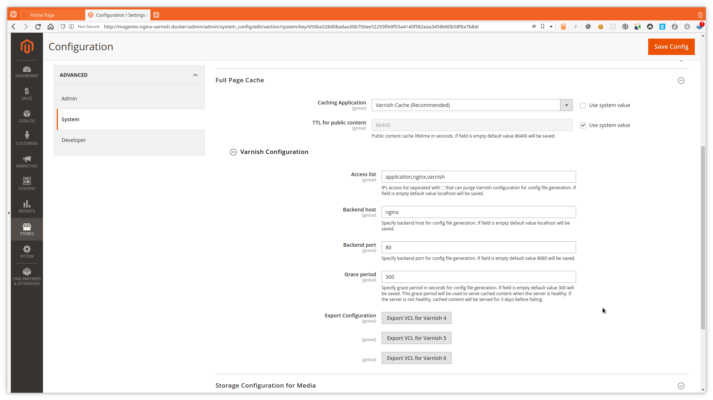

### Configure Magento to use LiteMage

First we must make sure the cache and LiteMage are enabled in Litespeed.
Therefore we will login to the Litespeed admin, in our test
`https://magento-litespeed-lscache.docker:7080`. There we will go to
`Configuration` -> `Server` -> `Cache` and edit the `Cache Storage Settings`,
these are empty by default. We will just enable the cache, set a location and a
public cache time.

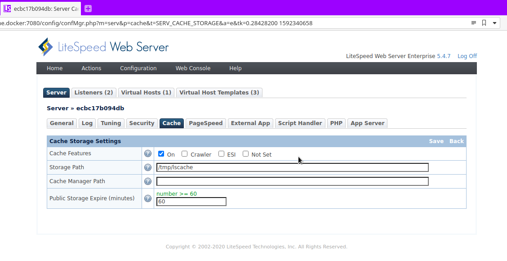

For Magento must login in the Magento admin, in the tests case
`http://magento-litespeed-lscache.docker/admin` and go to `Stores` ->
`Configuration` -> `Advanced` -> `System`. By default the 'Built-in' cache will
be selected. We disable `Use system value` and select `LiteMage Cache Built-in
to LiteSpeed Server`.

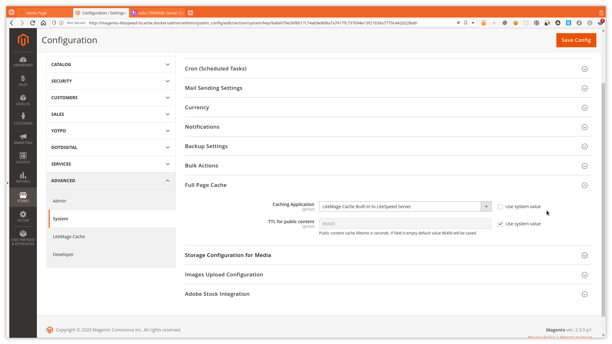

## The tests

### The method

We will use [siege][5] to run our tests. We will be using
[this configuration](./siegerc). We will also record the cpu and memory usage
with [psrecord][6] to see if there is a lot of difference to be seen there.

> The siegerc is updated so it uses `connection = keep-alive`. Because it seems
> if we use `connection = close` (the siege default) the connection got locked
> up from time to time in the OpenLiteSpeed tests.

Thanks to the people of Litespeedtech to help figure this out.

We will warmup both php and the web server by doing the requests for 20 seconds.
Then we will always record 80 seconds of cpu and memory usage, 10 seconds idle
time, 60 seconds test and again 10 seconds idle time.

For example:

```sh
#!/usr/bin/env bash

test_name="magento-warmup"
web_server="litespeed"
log_date="$(date +%Y%m%d%H%M%S)"
pid_openlitespeed="$(pgrep litespeed | head -n1)"
pid_lsphp="$(pgrep lsphp | head -n1)"

psrecord --log "$web_server-$test_name.psrecweb.$log_date.log" \
    --include-children --interval 1 --duration 80 "$pid_openlitespeed" &
psrecord --log "$web_server-$test_name.psrecphp.$log_date.log" \
    --include-children --interval 1 --duration 80 "$pid_lsphp" &

sleep 10
siege -R ./siegerc -c1 -t 60s -f urls.txt \
    > "$(pwd)/$web_server-$test_name.siege.$log_date.log" 2>&1
sleep 10
```

All runs will be done 3 times to be sure, and the averages will be used for
graphs and conclusions.

All docker-compose setups will be configured in a similar fashion as the
[DockerWest compose-magento][7] configuration. We will exclude elasticsearch
and if needed build custom images where needed (litespeed).

### Graph units

- cpu will be measured in % cpu. Since there are 12 threads in this machine in
  theory 1200% would indicate all cpu's are at 100% usage.
- memory will be measured in MB.

### static files test

We select 5 images we will get with a concurrency of 10 for 60 seconds. In this
test siege will get lowered priority so it does not take all cpu time away from
the software we really want to test.

We will use the following urls:

```
BASE=http://magento.docker
${BASE}/media/wysiwyg/home/home-pants.jpg
${BASE}/media/wysiwyg/home/home-erin.jpg
${BASE}/media/wysiwyg/home/home-main.jpg
${BASE}/media/wysiwyg/home/home-eco.jpg
${BASE}/media/wysiwyg/home/home-t-shirts.png
```

And run siege as follows:

```sh
nice -n19 siege -R ./siegerc -c10 -t 60s -f urls-static.txt \
    > "$(pwd)/magento-static.$(date +%Y%m%d%H%M%S).log" 2>&1
```

If we look at the transactions Litespeed can do versus Nginx, the difference is
obvious. Litespeed does handle static files a lot faster. And the Varnish /
Nginx setup has the added drawback that varnish has to do things even just to
pass it to Nginx.

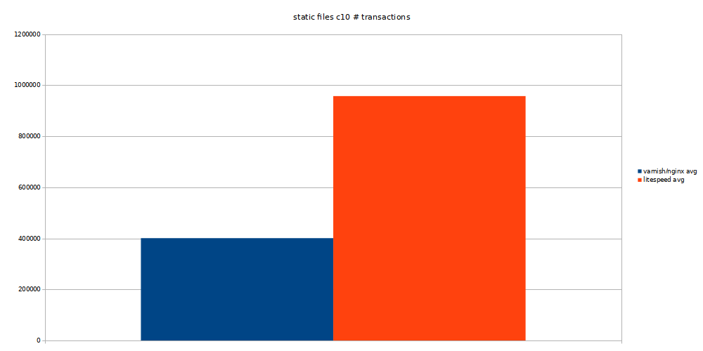
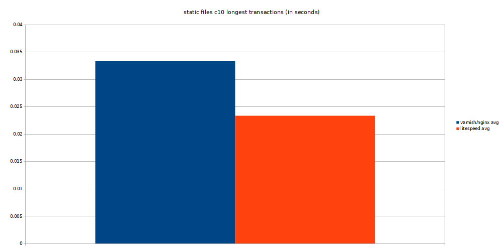

When we look at the cpu usage we see this reflected, below is the combined cpu
usage of Varnish and Nginx, but most of it is due to Varnish passing along the
request to Nginx. The memory usage of the setup with Varnish is higher because
Varnish will keep its cache in memory, where Litespeed keeps it on disk.

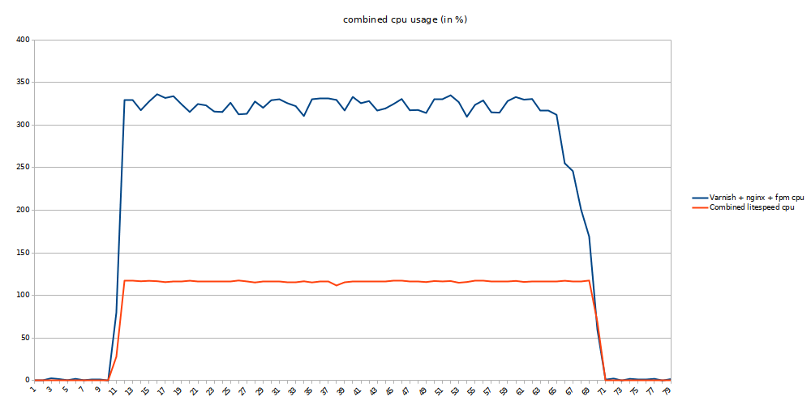
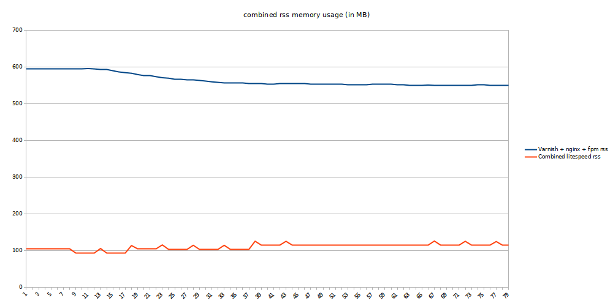

Litespeed is clearly the best choice to serve static files.

### magento test ("browsing")

We'll do 2 runs here, one where the concurrency is 1 as if we are doing a
single user reference run. Then a normal run with concurrency 15.

The following urls will be used:

```
BASE=http://magento.docker
${BASE}/what-is-new.html
${BASE}/women.html
${BASE}/men.html
${BASE}/gear.html
${BASE}/training.html
${BASE}/sale.html
${BASE}/catalogsearch/result/?q=hoodie
${BASE}/customer/account/login
${BASE}/contact/
${BASE}/catalogsearch/advanced/
${BASE}/privacy-policy-cookie-restriction-mode
${BASE}/customer/account/create/
${BASE}/women/tops-women/hoodies-and-sweatshirts-women.html
${BASE}/men/tops-men/hoodies-and-sweatshirts-men.html
${BASE}/catalogsearch/result/?q=bag
${BASE}/tiffany-fitness-tee.html
${BASE}/adrienne-trek-jacket.html
${BASE}/zoltan-gym-tee.html
${BASE}/taurus-elements-shell.html
${BASE}/luma-analog-watch.html
```

Since siege is running with the parser on the static files like css, js and
images are also loaded.

Our first test is just go to the pages one-by-one and see how that goes.

```sh
siege -R ./siegerc -c1 -t 60s -f urls.txt \
    > "$(pwd)/magento-warmup.$(date +%Y%m%d%H%M%S).log" 2>&1
```

So browsing to all this pages yields us a similar result, Litespeed gives us
much more transactions compared to the Varnish + Nginx setup. Even though
Litespeed handles a lot more transactions it also had the slowest transaction
in this test.

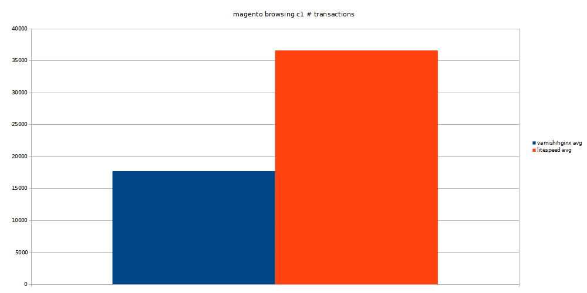
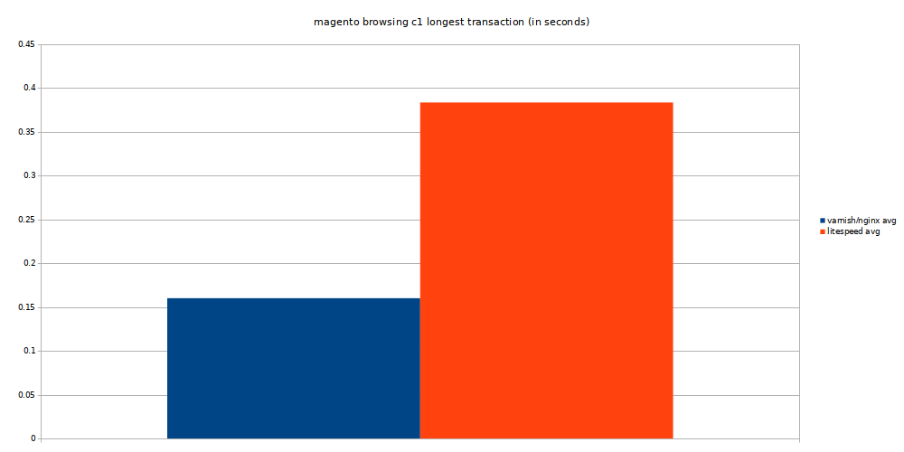

The cpu usage of Litespeed is practically half of the other setup. Memory wise
its also using almost half the amount.

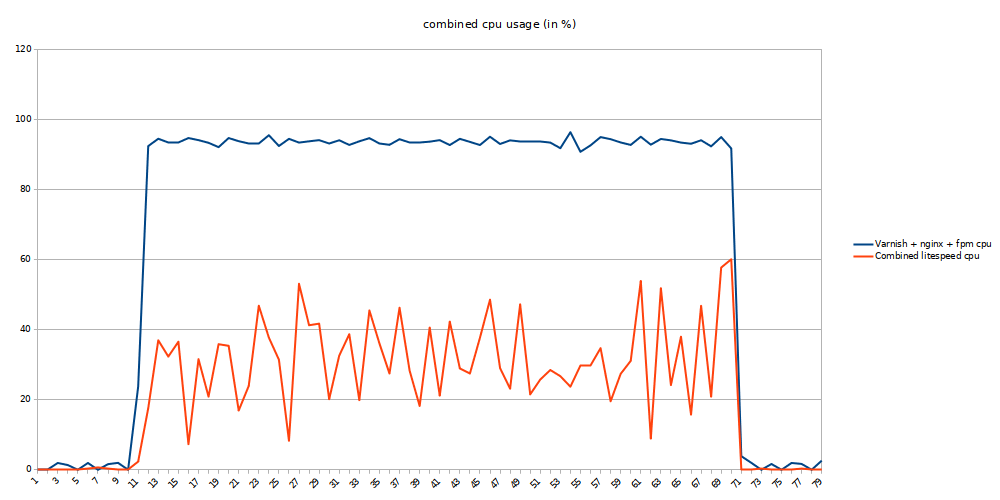
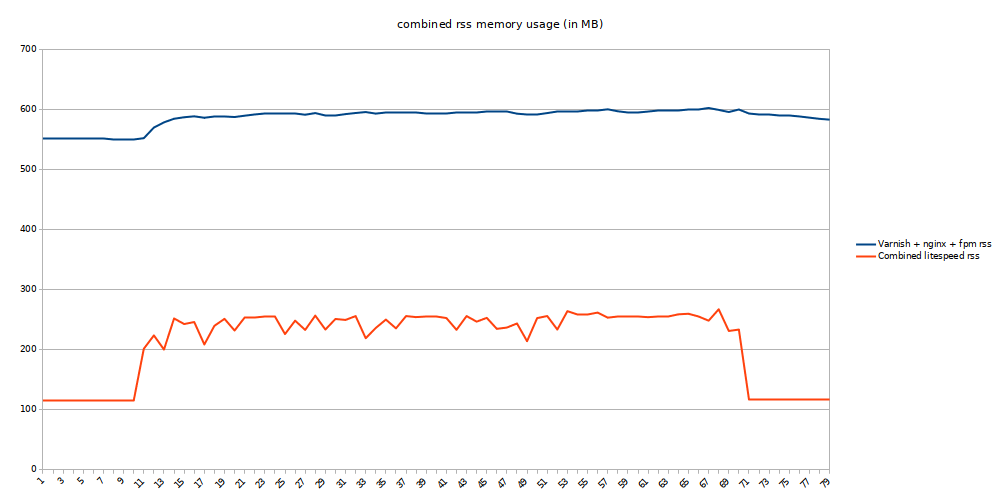

Second test is increasing the concurrency to 10 and see if everything holds up.

```sh
siege -R ./siegerc -c10 -t 60s -f urls.txt \
    > "$(pwd)/magento.$(date +%Y%m%d%H%M%S).log" 2>&1
```

When the concurrency rises, the difference in how many transactions are handled
between Litespeed and Varnish + Nginx stays similar as before. A bit more than
2x the transactions. But with the increased concurrency the longest transaction
also goes to Varnish + Nginx.

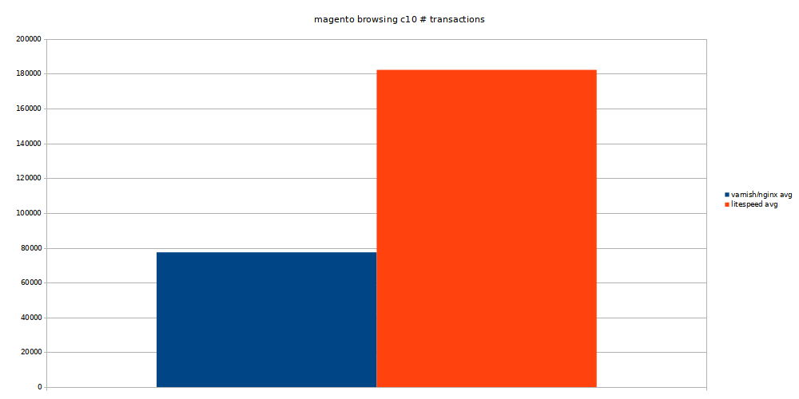
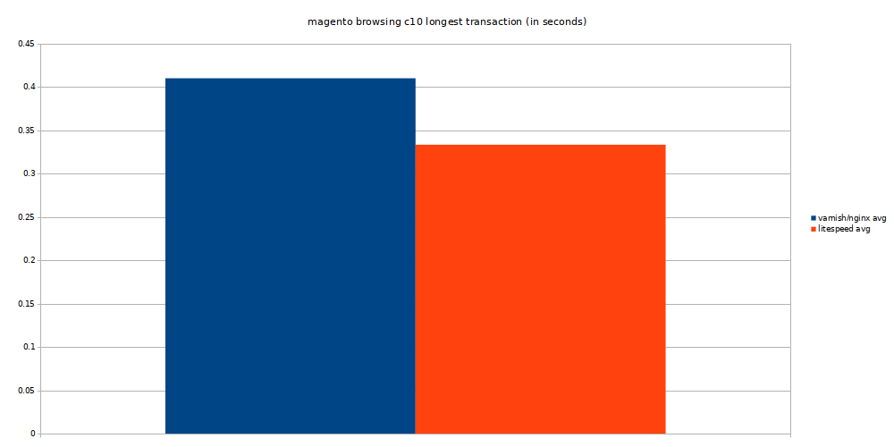

The cpu usage of Litespeed comes closer to the Varnish + Nginx setup in this
test, still well below it. Litespeed is using a bit more memory during the
transactions, but when the requests are done the memory is no longer in use.

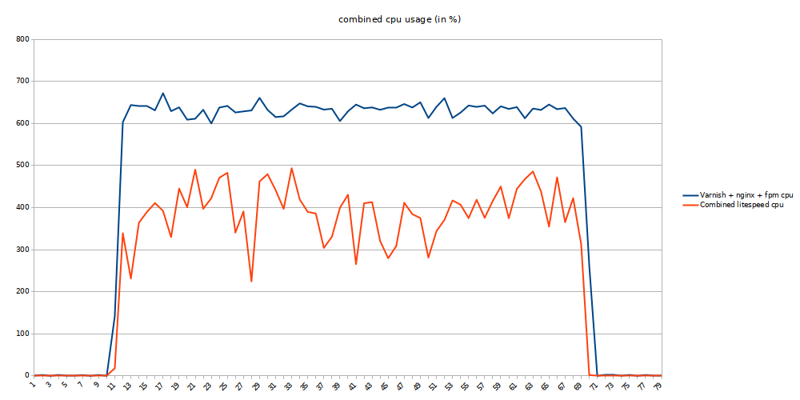
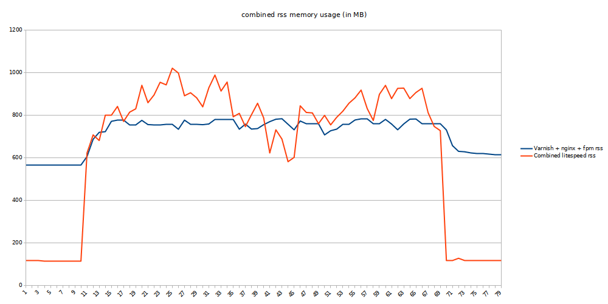

For regular browsing all sorts of pages, Litespeed clearly gives us the best
results. We see when the concurrency rises it handles a lot more transactions
for less cpu usage. The memory usage rises a bit above that of the Varnish +
Nginx setup, but for handling more than double of the transactions we can live
with that.

### magento test ("no parser")

We will now test how the cached pages compare to each other, we exclude the
static files so we can see how well the cached html responses compare to each
other.

```sh
siege -R ./siegerc --no-parser -c10 -t 60s -f urls.txt \
    > "$(pwd)/magento-noparser.$(date +%Y%m%d%H%M%S).log" 2>&1
```

We see a smaller difference of how many transactions can be done between
Litespeed and Varnish + Nginx. Litespeed still does more transactions and
Varnish + Nginx has the longest transaction.

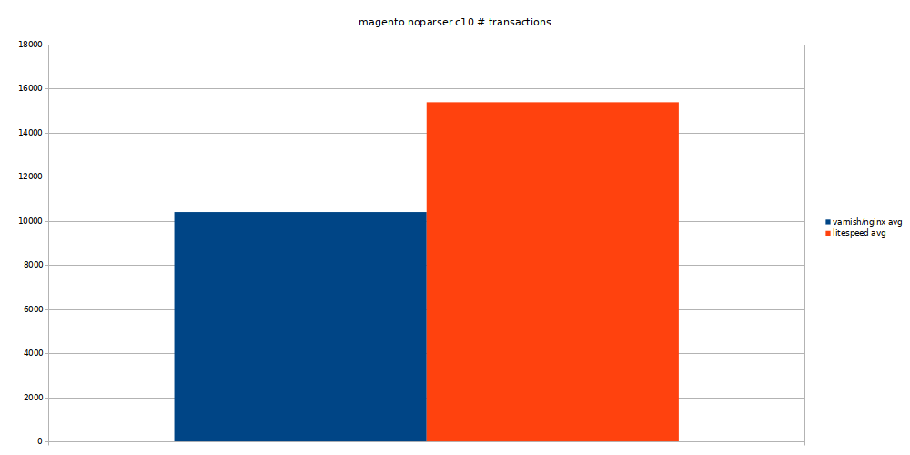
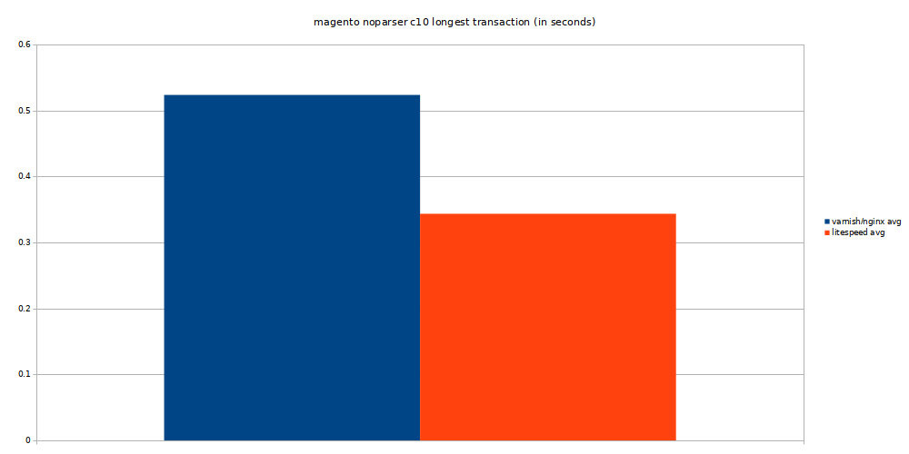

Now we see the cpu usage and memory usage of Litespeed is higher compared to
Varnish + Nginx.

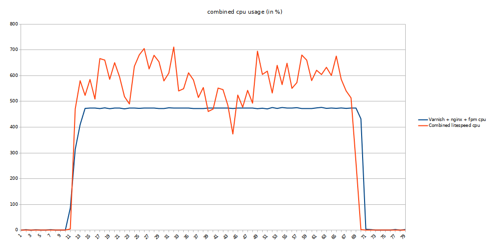
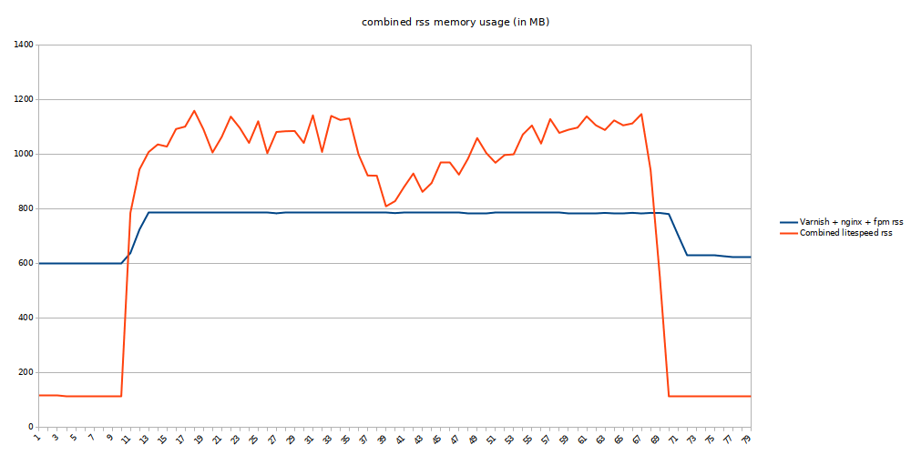

Despite the higher cpu usage and memory usage Litespeed comes out best since it
can handle more transactions.

### magento category page ("browsing")

Since the previous tests are potentially more randomized, we will browse a
specific category page and see how that behaves.

```sh
siege -R ./siegerc -c1 -t 60s \
    http://magento.docker/gear/bags.html \
    > "$(pwd)/magento-category-c1.$(date +%Y%m%d%H%M%S).log" 2>&1
```

So for a Magento 2 category page the number of transactions handled by
Litespeed versus Varnish + Nginx is massive. Given its a category page it will
have a multitude of smaller images which could be the reason. The longest
transaction is for the Varnish + Nginx combination.

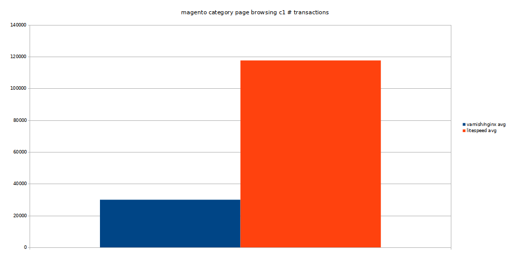
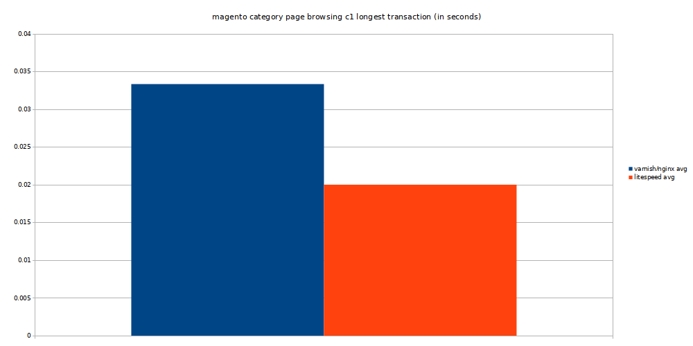

Litespeed uses a bit more cpu in this case. And the memory usage of the
Varnish + Nginx setup can be attributed to the fact there are already a lot of
pages in the cache.

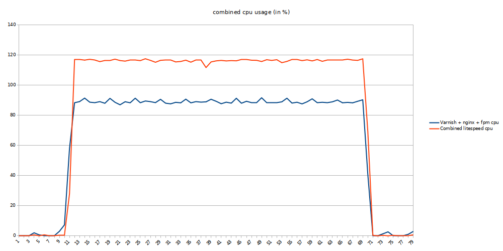
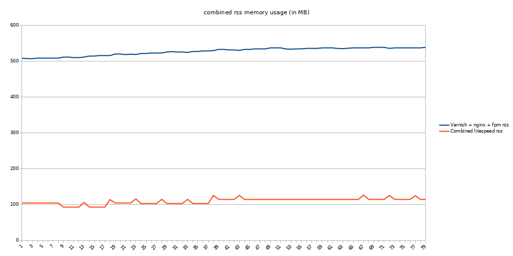

```sh
siege -R ./siegerc -c10 -t 60s \
    http://magento.docker/gear/bags.html \
    > "$(pwd)/magento-category-c10.$(date +%Y%m%d%H%M%S).log" 2>&1
```

While increasing the concurrency we see the same trend as with 1 concurrent
browser. Litespeed does a massive amount of more transactions but here the
difference between the longest transactions is larger.

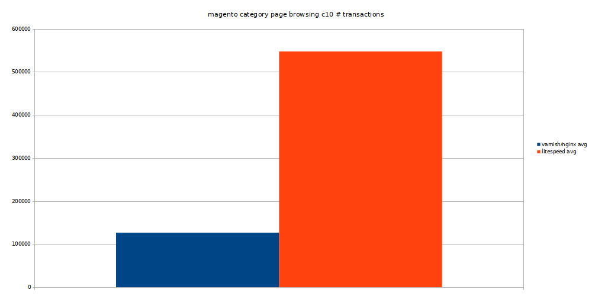
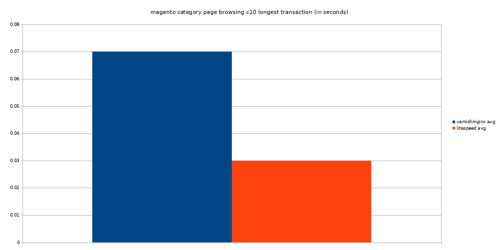

With the increased concurrency we see the cpu usage of Varnish + Nginx (php-fpm
is in there but those numbers are not significant since we are not hitting php)
is 5x higher than Litespeed. Even the memory usage increase of Varnish + Nginx
is higher, where we see almost no higher memory usage for Litespeed compared to
only 1 concurrent user.

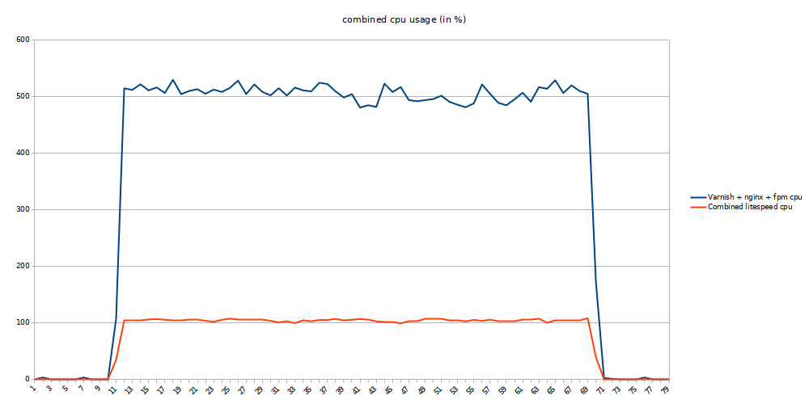
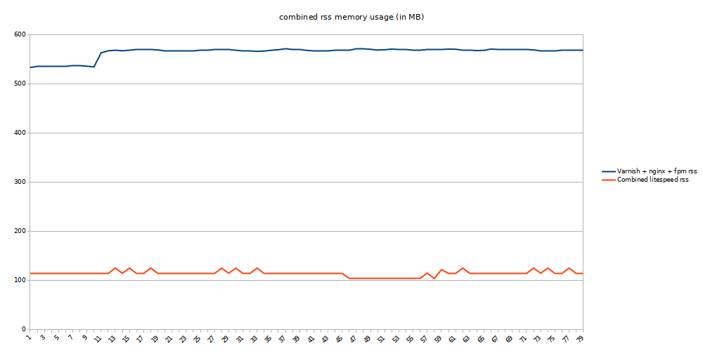

While browsing this category page Litespeed is able to do 4x more transactions
compared to Varnish + Nginx. Combine that with less cpu and memory usage with
the higher concurrency and you have a clear winner.

### magento category page ("no parser")

Again we will check how the cached pages compare to the full browsing
experience. This time with the specific category page to reduce the randomness
of the browsing. Here we will have a straight up comparison between Litespeed
cache and Varnish cache since we took out all the extras.

```sh
siege -R ./siegerc --no-parser -c1 -t 60s \
    http://magento.docker/gear/bags.html \
    > "$(pwd)/magento-category-noparser-c1.$(date +%Y%m%d%H%M%S).log" 2>&1
```

As expected the number of transactions is lower, so is the difference.
Litespeed is a bit faster. And the comparison between the longest transactions
is hardly possible because its 0.01s.

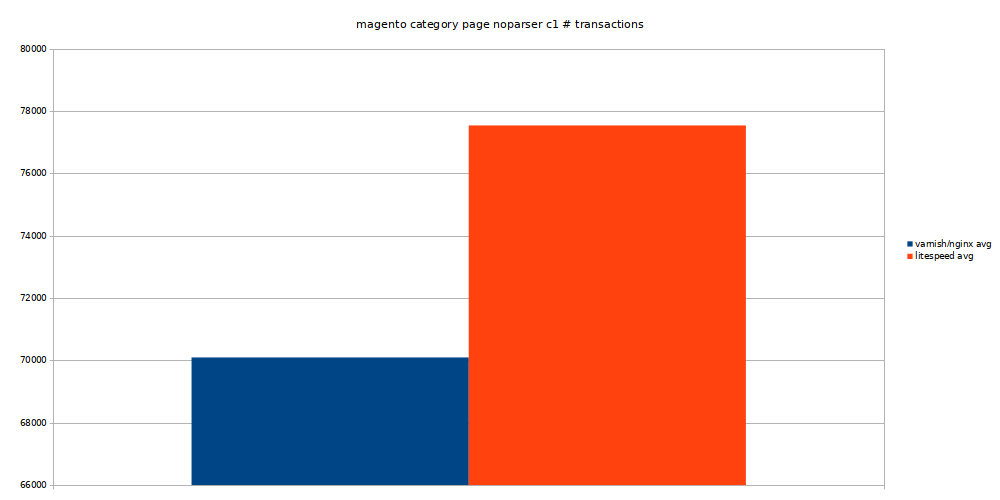
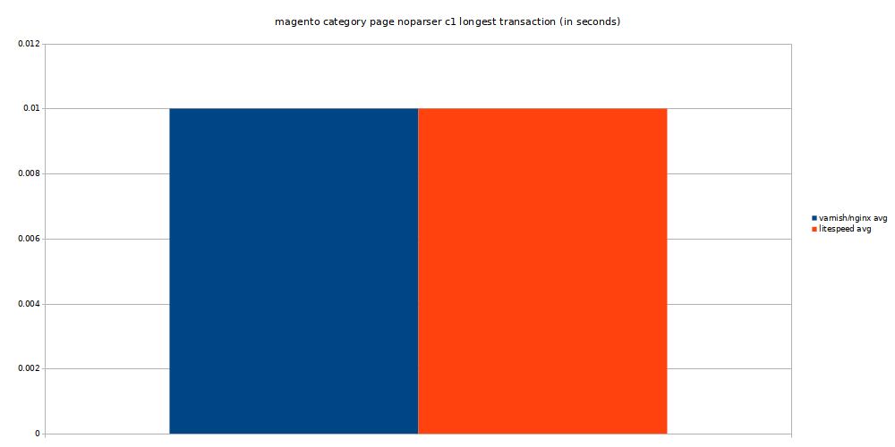

On the cpu side we see Litespeed can do these transactions with less cpu and
memory.

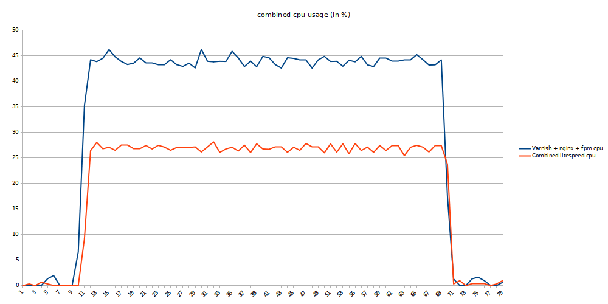
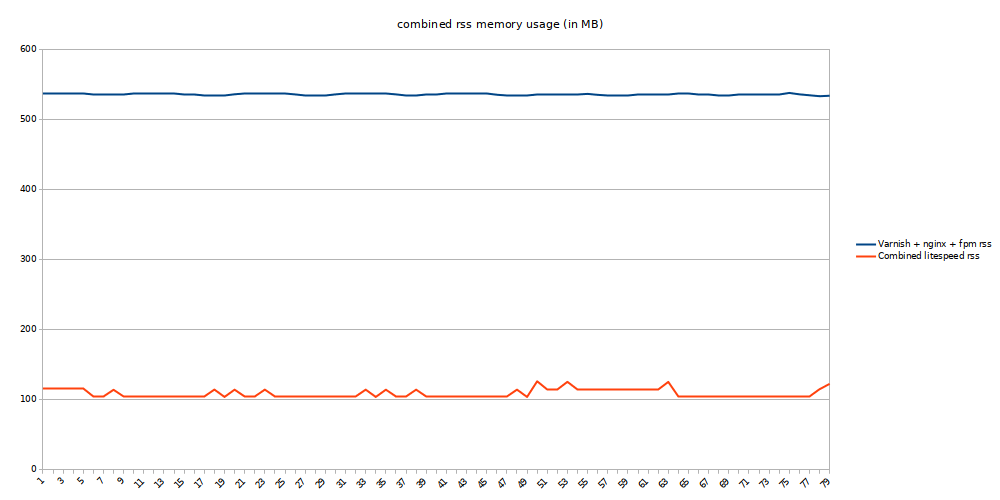

As before we are going to increase the concurrency to see if that changes
anything to the situation for better or worse.

```sh
siege -R ./siegerc --no-parser -c10 -t 60s \
    http://magento.docker/gear/bags.html \
    > "$(pwd)/magento-category-noparser-c10.$(date +%Y%m%d%H%M%S).log" 2>&1
```

In the number of transactions we see a similar difference, and the longest
transactions take a bit longer. Litespeed does not see such large long
transaction increase compared to Varnish + Nginx.

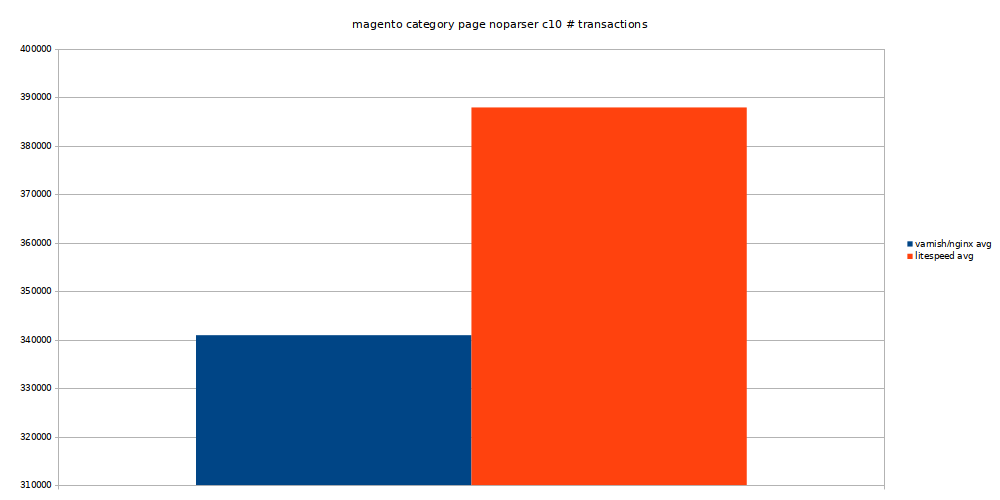
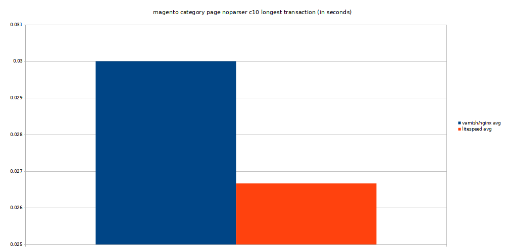

Litespeed's cpu usage is about half of the Varnish + Nginx combo. While the
memory usage stays pretty much the same as for 1 concurrent user. This is not
that strange since we are hitting the same page over and over again.

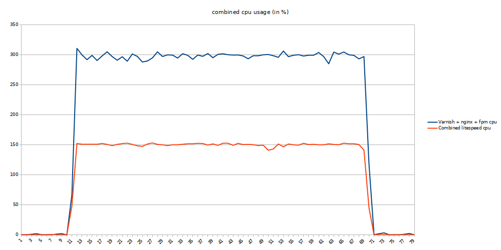
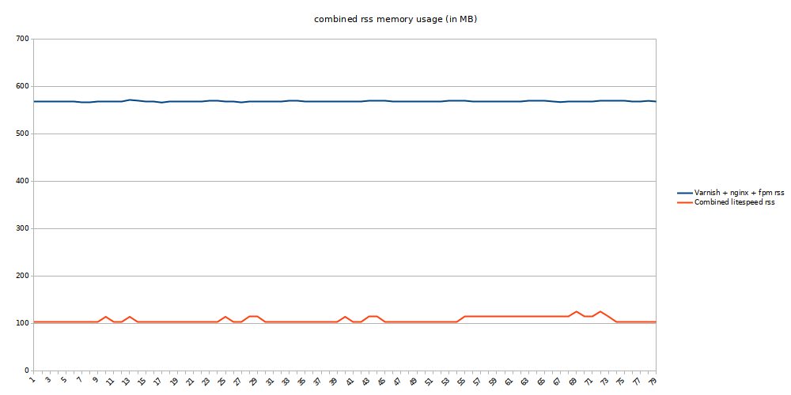

So again Litespeed is ahead in this test.

### All results

All results can be found in the following spreadsheets:

- [siege numbers](./litespeed-results-siege.ods)
- [memory - cpu static files](./litespeed-results-memory-cpu-static-files.ods)
- [memory - cpu magento browsing c1](./litespeed-results-memory-cpu-magento-browsing-c1.ods)
- [memory - cpu magento browsing c10](./litespeed-results-memory-cpu-magento-browsing-c10.ods)
- [memory - cpu magento noparser c10](./litespeed-results-memory-cpu-magento-noparser-c10.ods)
- [memory - cpu magento category page browsing c1](./litespeed-results-memory-cpu-magento-category-browsing-c1.ods)
- [memory - cpu magento category page browsing c10](./litespeed-results-memory-cpu-magento-category-browsing-c10.ods)
- [memory - cpu magento category page noparser c1](./litespeed-results-memory-cpu-magento-category-noparser-c1.ods)
- [memory - cpu magento category page noparser c10](./litespeed-results-memory-cpu-magento-category-noparser-c10.ods)

Those all contain additional graphs and detailed numbers. Only the most
relevant graphs to reach a conclusion are included in the blogpost.

## Conclusion

In practically all tests Litespeed was faster, and used less resources. If we
look at varied random browsing we can say Litespeed can do 2 times the number
of transactions compared to the Varnish + Nginx setup. If we specifically look
at the category page with many little static files it goes up to 4 times the
number of transactions. In the "noparser" tests where we only look at the speed
we get cached results back the difference is a lot smaller where we see that
Litespeed can do about 10% more transactions. There was not a single test in
here were Litespeed was threatened. Combine the higher number of transactions
with it not needing to keep the cache in memory and you have a clear advantage
using Litespeed.

So we can confirm the statement from Litespeed about
[Litespeed and Magento 2][2]:

> LiteMage Makes Magento 2 up to 4 Times Faster!

But let us stay somewhat modest and say that in most cases Litespeed can do
twice as much transactions compared to the competition.

[1]: https://www.litespeedtech.com/products/litespeed-web-server
[2]: https://www.litespeedtech.com/benchmarks/litespeed-magento2-faster-nginx-http2
[3]: https://varnish-cache.org/
[4]: https://github.com/litespeedtech/magento2-LiteSpeed_LiteMage
[5]: https://www.joedog.org/siege-home/
[6]: https://github.com/astrofrog/psrecord
[7]: https://github.com/dockerwest/compose-magento
[8]: https://blog.herecura.eu/blog/2020-06-16-openlitespeed-vs-apache-vs-nginx/
