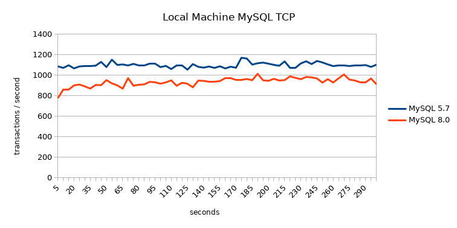
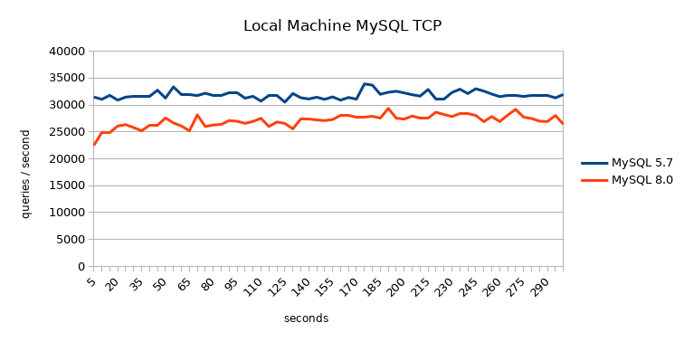
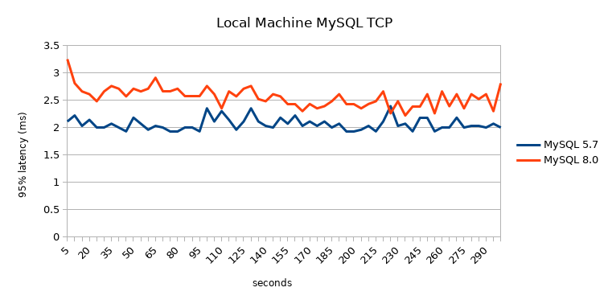
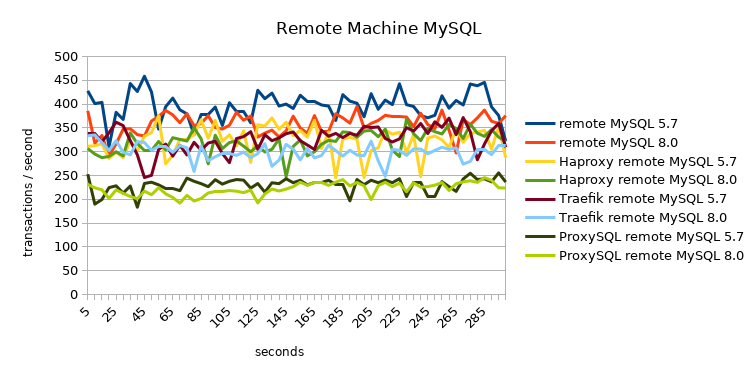
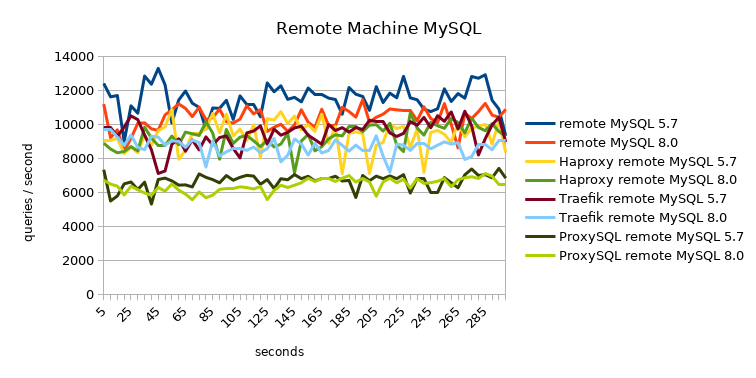
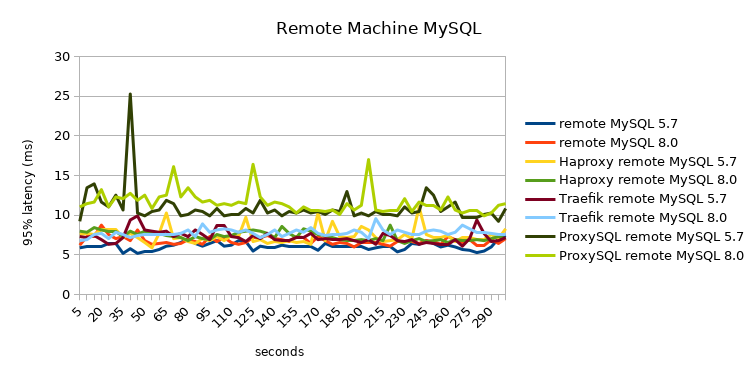
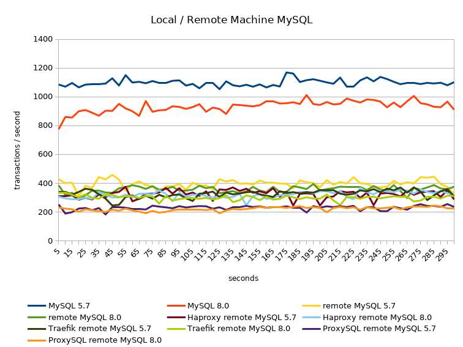
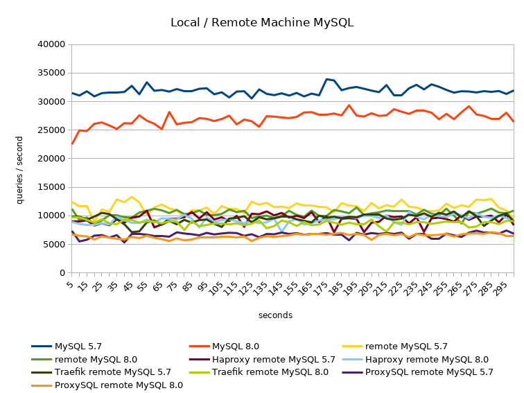
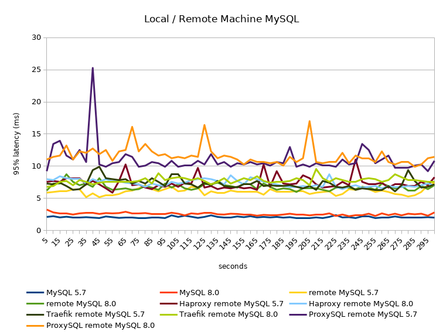

When connecting to a remote MySQL server there can be a pretty big performance
impact, just due the fact we are using TCP to transfer our data. Where
connecting over a socket is usually blazingly fast, introducing TCP to do that
might give us a performance penalty on our application.  We have seen some
information on [local tests][1], but how do these behave in the real world. So
we will need to test how these sysbench tests will behave on actual production
hardware. How much performance drop we see when we actually connect remotely to
MySQL and is the difference between the proxies still pretty big.

<!--more-->

## What will we test

For MySQL we want to test both 5.7 and 8.0, we can't keep running MySQL 5.x
forever :).

- [MySQL][2] 5.7 (Percona Server 5.7.32-35)
- [MySQL][2] 8.0 (Percona Server 8.0.22-13)

And as proxies we will use the same ones we used in the [local tests][1]. We
will use the configurations as they can be found in the [playground][6], only
with different ip adresses and the user / password combinations will be
different, but these don't impose a relevant change to the test.

- [Haproxy][3] 2.3.5
- [Traefik][4] 2.4.3
- [ProxySQL][5] 2.0.17

The test itself will be run with [sysbench][7].

```sh
#!/usr/bin/env bash

sysbench \
    /usr/share/sysbench/oltp_read_only.lua \
    --threads="2" \
    --tables=10 \
    --table-size=1000000 \
    --report-interval=5 \
    --rand-type=pareto \
    --forced-shutdown=1 \
    --time=300 \
    --events=0 \
    --point-selects=25 \
    --range_size=5 \
    --skip_trx=on \
    --percentile=95  \
    --mysql-host=mysql.to.test \
    --mysql-port=3306 \
    --mysql-user=bench \
    --mysql-password=our-fancy-bench-password \
    --mysql-db=bench \
    --mysql-storage-engine=INNODB \
    run
```

We will run with only 2 threads so we always compare the same information.

In our results we will be most interested in the number of transactions /
queries per second and what the 95% latency is during that time.

## MySQL 5.7 vs 8.0 on local machine

As a baseline we already want to know how both these versions compare when we
run `sysbench` on the local machine over TCP.

Results for MySQL 5.7

```
SQL statistics:
    queries performed:
        read:                            9553412
        write:                           0
        other:                           0
        total:                           9553412
    transactions:                        329428 (1098.07 per sec.)
    queries:                             9553412 (31844.15 per sec.)
    ignored errors:                      0      (0.00 per sec.)
    reconnects:                          0      (0.00 per sec.)

General statistics:
    total time:                          300.0039s
    total number of events:              329428

Latency (ms):
         min:                                    1.18
         avg:                                    1.82
         max:                                   17.65
         95th percentile:                        2.03
         sum:                               599617.66

Threads fairness:
    events (avg/stddev):           164714.0000/9.00
    execution time (avg/stddev):   299.8088/0.00
```

Results for MySQL 8.0

```
SQL statistics:
    queries performed:
        read:                            8120406
        write:                           0
        other:                           0
        total:                           8120406
    transactions:                        280014 (933.37 per sec.)
    queries:                             8120406 (27067.71 per sec.)
    ignored errors:                      0      (0.00 per sec.)
    reconnects:                          0      (0.00 per sec.)

General statistics:
    total time:                          300.0021s
    total number of events:              280014

Latency (ms):
         min:                                    1.35
         avg:                                    2.14
         max:                                   18.71
         95th percentile:                        2.61
         sum:                               599620.24

Threads fairness:
    events (avg/stddev):           140007.0000/26.00
    execution time (avg/stddev):   299.8101/0.00
```







Summary:

type      | transactions / sec | queries / sec | 95% latency (ms)
----------|-------------------:|--------------:|-----------------:
MySQL 5.7 | 1098.07            | 31844.15      | 2.03
MySQL 8.0 | 933.37             | 27067.71      | 2.61

So we see already that MySQL 8.0 only gives us 85% of the troughput with the
same configuration. Also the percieved latency increases when we start using
MySQL 8.0.

## MySQL 5.7 vs 8.0 from remote with and without proxies

Let us see how the different proxies / remote connections behave.

Results direct connection to MySQL 5.7

```
SQL statistics:
    queries performed:
        read:                            3452044
        write:                           0
        other:                           0
        total:                           3452044
    transactions:                        119036 (396.77 per sec.)
    queries:                             3452044 (11506.45 per sec.)
    ignored errors:                      0      (0.00 per sec.)
    reconnects:                          0      (0.00 per sec.)

General statistics:
    total time:                          300.0082s
    total number of events:              119036

Latency (ms):
         min:                                    3.33
         avg:                                    5.04
         max:                                  235.47
         95th percentile:                        6.21
         sum:                               599827.35

Threads fairness:
    events (avg/stddev):           59518.0000/164.00
    execution time (avg/stddev):   299.9137/0.00
```

Results direct connection to MySQL 8.0

```
SQL statistics:
    queries performed:
        read:                            3113846
        write:                           0
        other:                           0
        total:                           3113846
    transactions:                        107374 (357.90 per sec.)
    queries:                             3113846 (10379.20 per sec.)
    ignored errors:                      0      (0.00 per sec.)
    reconnects:                          0      (0.00 per sec.)

General statistics:
    total time:                          300.0068s
    total number of events:              107374

Latency (ms):
         min:                                    3.53
         avg:                                    5.59
         max:                                  235.52
         95th percentile:                        6.79
         sum:                               599819.55

Threads fairness:
    events (avg/stddev):           53687.0000/58.00
    execution time (avg/stddev):   299.9098/0.00
```

Results Haproxy connection to MySQL 5.7

```
SQL statistics:
    queries performed:
        read:                            2818568
        write:                           0
        other:                           0
        total:                           2818568
    transactions:                        97192  (323.97 per sec.)
    queries:                             2818568 (9395.09 per sec.)
    ignored errors:                      0      (0.00 per sec.)
    reconnects:                          0      (0.00 per sec.)

General statistics:
    total time:                          300.0031s
    total number of events:              97192

Latency (ms):
         min:                                    4.46
         avg:                                    6.17
         max:                                  226.03
         95th percentile:                        7.43
         sum:                               599824.61

Threads fairness:
    events (avg/stddev):           48596.0000/90.00
    execution time (avg/stddev):   299.9123/0.00
```

Results Haproxy connection to MySQL 8.0

```
SQL statistics:
    queries performed:
        read:                            2792990
        write:                           0
        other:                           0
        total:                           2792990
    transactions:                        96310  (321.03 per sec.)
    queries:                             2792990 (9309.79 per sec.)
    ignored errors:                      0      (0.00 per sec.)
    reconnects:                          0      (0.00 per sec.)

General statistics:
    total time:                          300.0044s
    total number of events:              96310

Latency (ms):
         min:                                    4.16
         avg:                                    6.23
         max:                                  219.98
         95th percentile:                        7.43
         sum:                               599839.42

Threads fairness:
    events (avg/stddev):           48155.0000/79.00
    execution time (avg/stddev):   299.9197/0.00
```

Results Traefik connection to MySQL 5.7

```
SQL statistics:
    queries performed:
        read:                            2846756
        write:                           0
        other:                           0
        total:                           2846756
    transactions:                        98164  (327.21 per sec.)
    queries:                             2846756 (9488.97 per sec.)
    ignored errors:                      0      (0.00 per sec.)
    reconnects:                          0      (0.00 per sec.)

General statistics:
    total time:                          300.0054s
    total number of events:              98164

Latency (ms):
         min:                                    4.45
         avg:                                    6.11
         max:                                  299.99
         95th percentile:                        7.43
         sum:                               599828.18

Threads fairness:
    events (avg/stddev):           49082.0000/178.00
    execution time (avg/stddev):   299.9141/0.00
```

Results Traefik connection to MySQL 8.0

```
SQL statistics:
    queries performed:
        read:                            2613973
        write:                           0
        other:                           0
        total:                           2613973
    transactions:                        90137  (300.45 per sec.)
    queries:                             2613973 (8712.97 per sec.)
    ignored errors:                      0      (0.00 per sec.)
    reconnects:                          0      (0.00 per sec.)

General statistics:
    total time:                          300.0079s
    total number of events:              90137

Latency (ms):
         min:                                    4.45
         avg:                                    6.66
         max:                                  201.54
         95th percentile:                        7.84
         sum:                               599871.02

Threads fairness:
    events (avg/stddev):           45068.5000/5.50
    execution time (avg/stddev):   299.9355/0.00
```

Results ProxySQL connection to MySQL 5.7

```
SQL statistics:
    queries performed:
        read:                            2004335
        write:                           0
        other:                           0
        total:                           2004335
    transactions:                        69115  (230.38 per sec.)
    queries:                             2004335 (6680.88 per sec.)
    ignored errors:                      0      (0.00 per sec.)
    reconnects:                          0      (0.00 per sec.)

General statistics:
    total time:                          300.0095s
    total number of events:              69115

Latency (ms):
         min:                                    5.66
         avg:                                    8.68
         max:                                  135.92
         95th percentile:                       10.65
         sum:                               599852.74

Threads fairness:
    events (avg/stddev):           34557.5000/35.50
    execution time (avg/stddev):   299.9264/0.00
```

Results ProxySQL connection to MySQL 8.0

```
SQL statistics:
    queries performed:
        read:                            1930182
        write:                           0
        other:                           0
        total:                           1930182
    transactions:                        66558  (221.85 per sec.)
    queries:                             1930182 (6433.69 per sec.)
    ignored errors:                      0      (0.00 per sec.)
    reconnects:                          0      (0.00 per sec.)

General statistics:
    total time:                          300.0100s
    total number of events:              66558

Latency (ms):
         min:                                    5.85
         avg:                                    9.01
         max:                                  138.03
         95th percentile:                       11.65
         sum:                               599890.62

Threads fairness:
    events (avg/stddev):           33279.0000/7.00
    execution time (avg/stddev):   299.9453/0.00
```







Summary:

type                  | transactions / sec | queries / sec | 95% latency (ms)
----------------------|-------------------:|--------------:|-----------------:
direct -> MySQL 5.7   | 396.77             | 11506.45      | 6.21
direct -> MySQL 8.0   | 357.90             | 10379.20      | 6.79
Haproxy -> MySQL 5.7  | 323.97             | 9395.09       | 7.43
Haproxy -> MySQL 8.0  | 321.03             | 9309.79       | 7.43
Traefik -> MySQL 5.7  | 327.21             | 9488.97       | 7.43
Traefik -> MySQL 8.0  | 300.45             | 8712.97       | 7.84
ProxySQL -> MySQL 5.7 | 230.38             | 6680.88       | 10.65
ProxySQL -> MySQL 8.0 | 221.85             | 6433.69       | 11.65

We see a difference between MySQL 5.7 and 8.0 where we have about 90%
throughput with MySQL 8.0. Both TCP proxies give us about 80% throughput
compared to direct connection to MySQL. What is really surprising is that
ProxySQL only gives us a little below 60% throughput. We must also note that
the caching which is enabled in ProxySQL does not work because `sysbench` only
does prepared statements and those won't be cached by ProxySQL as described in
the documentation of [Limitiations of query cache][8].

## Local vs Remote

When we look at our local results versus our remote results - and the test
machines are in the same datacenter - the difference in throughput local vs
remote is fairly high.







All results and some fun tests with long distance throughput and latency can be
found in this [calc sheet](./mysql-tcp-comparison.ods).

## Conclusion

type            | transactions / sec | queries / sec | 95% latency (ms) | percentage
----------------|-------------------:|--------------:|-----------------:|-----------:
MySQL 5.7       | 1098.07            | 31844.15      | 2.03             | 100%
MySQL 8.0       | 933.37             | 27067.71      | 2.61             | 85%
direct -> 5.7   | 396.77             | 11506.45      | 6.21             | 36.1%
direct -> 8.0   | 357.90             | 10379.20      | 6.79             | 32.6%
Haproxy -> 5.7  | 323.97             | 9395.09       | 7.43             | 29.5%
Haproxy -> 8.0  | 321.03             | 9309.79       | 7.43             | 29.2%
Traefik -> 5.7  | 327.21             | 9488.97       | 7.43             | 29.8%
Traefik -> 8.0  | 300.45             | 8712.97       | 7.84             | 27.4%
ProxySQL -> 5.7 | 230.38             | 6680.88       | 10.65            | 21%
ProxySQL -> 8.0 | 221.85             | 6433.69       | 11.65            | 20.2%

If we really want to have maximum throughput of our MySQL queries we need a
local installation of MySQL since best case we already lose over 60% throughput
once we introduce a real network connection. So this is very bad for
applications that lean heavy on their MySQL backend.

Sadly enough we don't get a proper view of what ProxySQL could potentially do
in terms of caching. But if we look at that we serve mostly PHP applications
and many of those use prepared statements everywhere it could be that ProxySQL
can't help us too much in that area. We'll have to find out in a real life
test (TODO).

[1]: https://blog.herecura.eu/blog/2021-02-18-proxying-mysql-setting-things-up/
[2]: https://www.percona.com/software/mysql-database/percona-server
[3]: https://www.haproxy.org
[4]: https://traefik.io/traefik/
[5]: https://proxysql.com
[6]: https://github.com/BlackIkeEagle/proxysql-playground
[7]: https://github.com/akopytov/sysbench
[8]: https://proxysql.com/documentation/query-cache/
