We have previously done several synthetic benchmarks. To finalize the tests
with different proxies we will test if we see impact on real life - yet demo -
applications.

Therefore we have choosen to test with sample e-commerce sites, one based on
Wordpress, another based on Magento. Note we will not try to compare both
platforms but measure the impact of the place of our mysql on the application.

<!--more-->

## Wordpress setup

- [Wordpress][1] 5.6.2
- [Nginx][2] 1.18.0
- [PHP][3] 7.4.12
- [MySQL][4] 8.0 ([Percona Server][5] 8.0.22-13)

To get an easy demo site we make use of the [Astra theme][6] which comes with a
"Starter Templates" plugin. This makes it very easy to just import a sample
website with the needed plugins and content. For this test we have choosen to
use the ["Brandstore" template][7]. We will use this shop without further
customization to see if we can detect performance differences between the
different ways we will use to access MySQL.


## Magento setup

- [Magento][8] 2.4.2
- [Nginx][2] 1.18.0
- [PHP][3] 7.4.15
- [MySQL][4] 8.0 ([Percona Server][5] 8.0.22-13)
- [Elasticsearch][9] 7.10.2

We will use the default Magento demo site Luma. In the installation we
deliberatly disabled redis cache. We will also run the Magento store in
"default" mode, but we will disable both the page cache and the block cache to
maximize the use of MySQL.


## The tests

For each of these e-commerce applications we will run [Siege][10] with
concurrency 2 - we are not looking to maximize throughput - and test 3 separate
pages, the homepage, a category page and a product page. We will run the tests
with local MySQL, remote MySQL, MySQL via Haproxy, MySQL via Traefik and MySQL
via ProxySQL.

The used `siegerc`

```conf
verbose = true
color = on
quiet = false
json_output = false
show-logfile = true
logging = false
gmethod = GET
parser = false
protocol = HTTP/1.1
chunked = true
cache = false
connection = keep-alive
delay = 0.0
internet = false
benchmark = false
accept-encoding = gzip, deflate
url-escaping = true
```

Wordpress testscript:

```sh
#!/usr/bin/env bash

[[ -z "$1" ]] && echo "pass testdistance" && exit 1

siege -R ./siegerc -c 2 -t 60s \
  "https://wordpress.bench" \
  > "wordpress-$1-home-page.siege.log" 2>&1
siege -R ./siegerc -c 2 -t 60s \
  "https://wordpress.bench/?product_cat=women" \
  > "wordpress-$1-category-page.siege.log" 2>&1
siege -R ./siegerc -c 2 -t 60s \
  "https://wordpress.bench/?product=bright-red-bag" \
  > "wordpress-$1-product-page.siege.log" 2>&1
```

Magento testscript:

```sh
#!/usr/bin/env bash

[[ -z "$1" ]] && echo "pass testdistance" && exit 1

siege -R ./siegerc -c 2 -t 60s \
  "https://magento.bench" \
  > "magento-$1-home-page.siege.log" 2>&1
siege -R ./siegerc -c 2 -t 60s \
  "https://magento.bench/men/tops-men/jackets-men.html" \
  > "magento-$1-category-page.siege.log" 2>&1
siege -R ./siegerc -c 2 -t 60s \
  "https://magento.bench/beaumont-summit-kit.html" \
  > "magento-$1-product-page.siege.log" 2>&1
```

## Wordpress test

We'll check how many hits we get and how good our pages response times are. We
are only looking at the rendering of the page because that is the part where we
will see MySQL impact.

Home page:

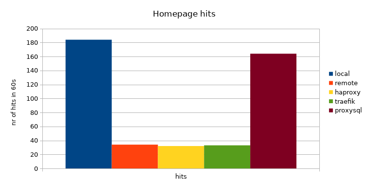

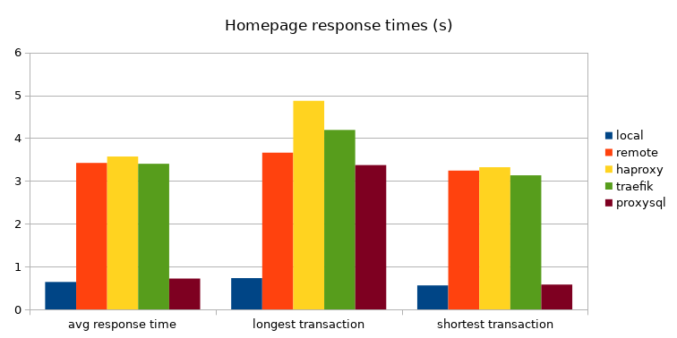

Category page:

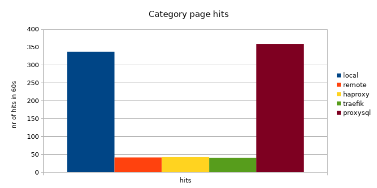

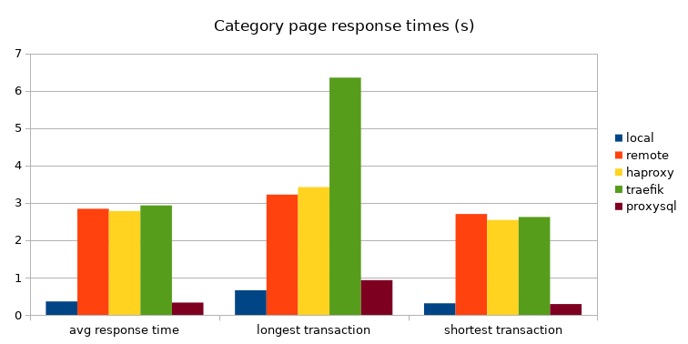

Product page:

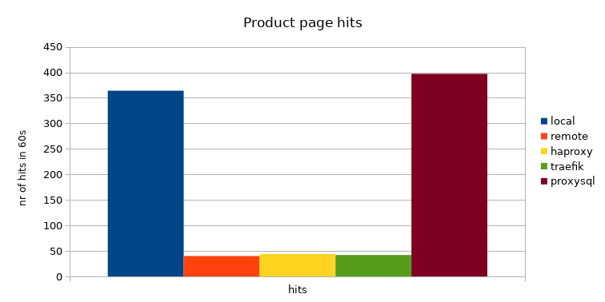

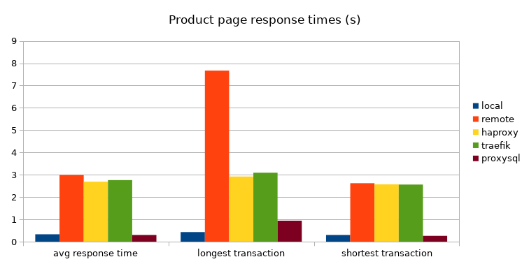

What we see here is that the local ProxySQL with 60s `SELECT` query caching
brings us very close to the results we have with a local MySQL database. There
can be longer transactions with ProxySQL when it has to build up it's cache but
once the cache is there it's practiaclly the same as local MySQL. The other
proxies don't have this advantage and it obviously shows.

## Magento test

Lets verify if we see similar behaviour with Magento. Here we deliberatly
disabled redis and block/page cache.

Home page:

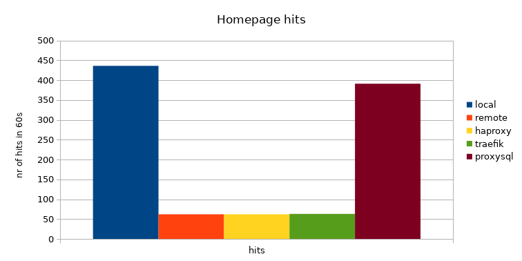

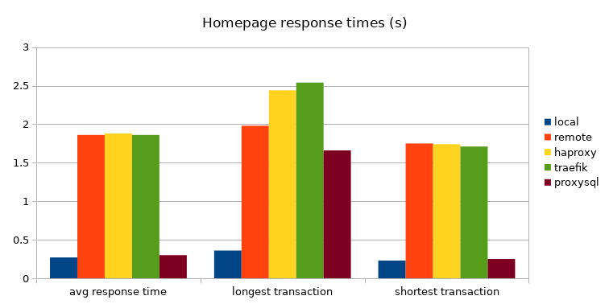

Category page:

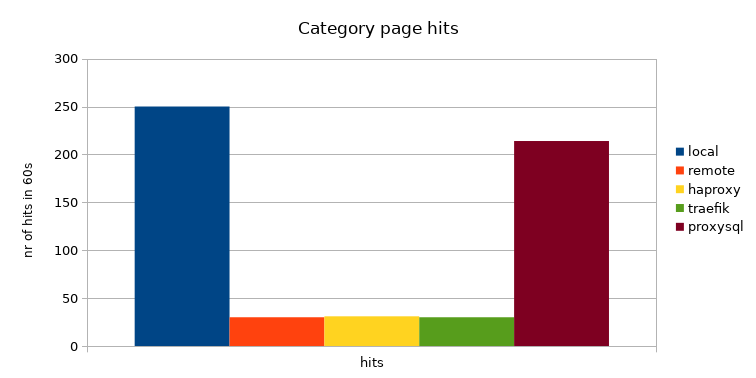

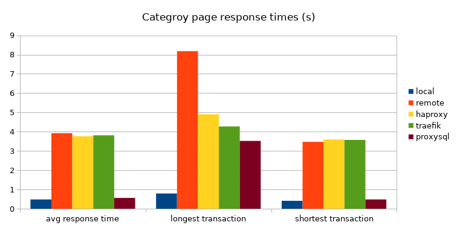

Product page:

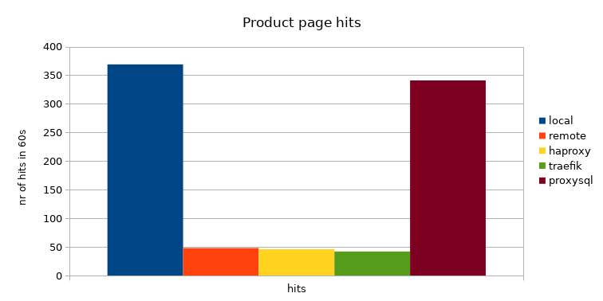

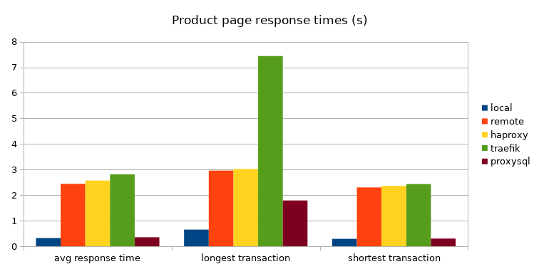

Here we see the same trend that the ProxySQL caching helps a lot. It looks a
bit less significant compared to the Wordpress results, but still massively
better than plain TCP proxies or long distance MySQL connection.

## Extended Magento test

Since we already see the ProxySQL caching can have a pretty big impact. Let us
see if we change the cache durations if there is a significant change.

Home page:

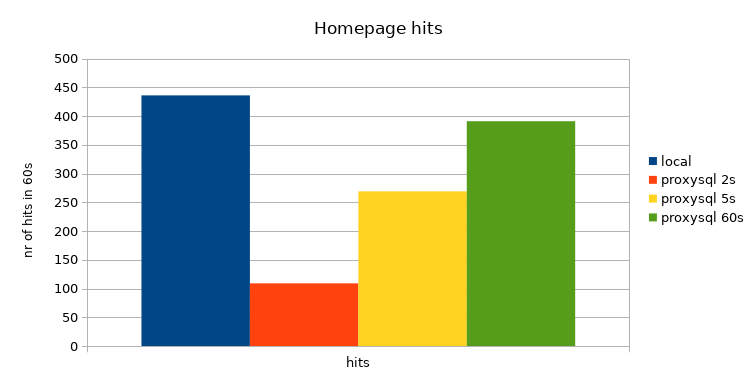

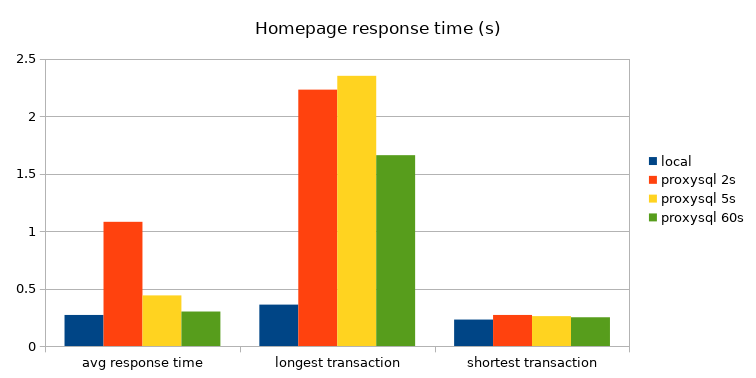

Category page:

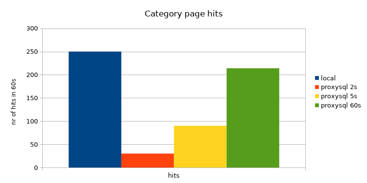

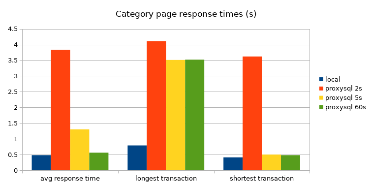

Product page:

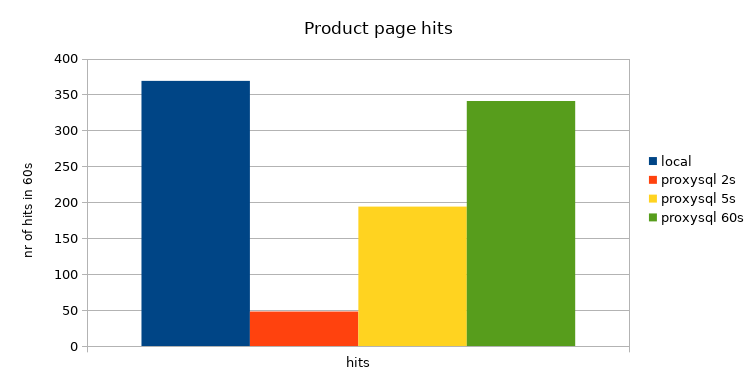

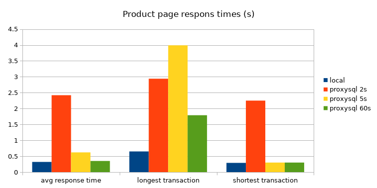

Here we see, the longer we can keep results in cache the better the result. No
surprise there. This also implies to leverage the power of ProxySQL we need an
application with sufficient traffic, because if we hit uncached results our
performance will look bad.

## Conclusion

In these application tests we clearly see there is a big advantage when using
ProxySQL with a high enough cache duration. The regular TCP proxies add nothing
here but some additional overhead. The large difference between local and TCP
proxied results are due to the fact the MySQL server was approached from
outside the datacenter, but that is an additional point for the caching power
of ProxySQL.

Some details can be found in added [calc sheet](./application-pageload-comparison.ods).

[1]: https://wordpress.org
[2]: https://nginx.org/en/
[3]: https://www.php.net
[4]: https://www.mysql.com
[5]: https://www.percona.com/software/mysql-database
[6]: https://wpastra.com
[7]: https://websitedemos.net/brandstore-02/
[8]: https://magento.com
[9]: https://www.elastic.co/elasticsearch/
[10]: https://www.joedog.org/siege-home/
