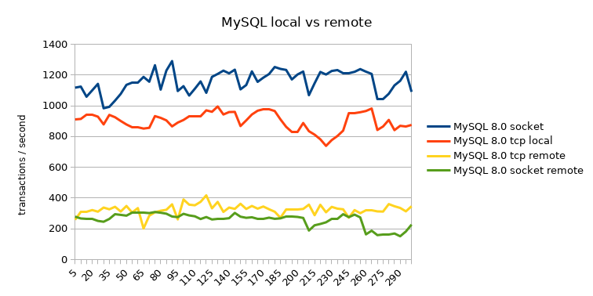
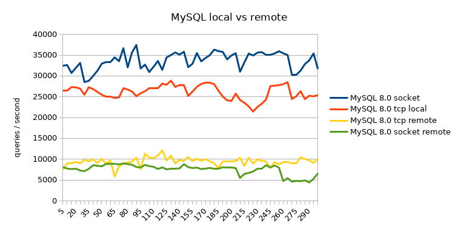
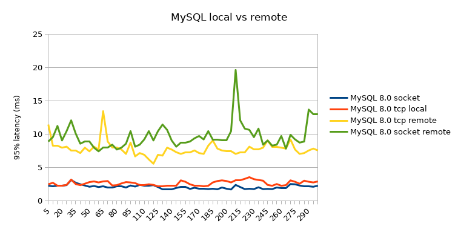

The series of Proxying MySQL left one thing unanswered. How large is the
difference between using local TCP or the socket. Yesterday I learned about
socat, shame on me that I did not knew about this tool, so lets drop another
remote test in there as well.

<!--more-->

## Goal

Determine if there is a significant difference when using local TCP vs local
socket connection to MySQL.

## What will we test

- [MySQL][1] 8.0 (Percona Server 8.0.22-13)

The following tests will be executed:

- local on the socket `/var/run/mysqld/mysqld.sock`
- local with TCP connection
- remote TCP
- remote fake socket with [`socat`][2]

The test itself will be run with [sysbench][3].

```sh
#!/usr/bin/env bash

sysbench \
    /usr/share/sysbench/oltp_read_only.lua \
    --threads="2" \
    --tables=10 \
    --table-size=1000000 \
    --report-interval=5 \
    --rand-type=pareto \
    --forced-shutdown=1 \
    --time=300 \
    --events=0 \
    --point-selects=25 \
    --range_size=5 \
    --skip_trx=on \
    --percentile=95  \
    --mysql-host=mysql.to.test \
    --mysql-port=3306 \
    --mysql-user=bench \
    --mysql-password=our-fancy-bench-password \
    --mysql-db=bench \
    --mysql-storage-engine=INNODB \
    run
```

We will run with only 2 threads so we always compare the same information.

We will again look at the transactions/queries per second and what the 95
percentile latency is for the used connections.

## socat usage

On the MySQL server machine we disable networking on the MySQL server.

We'll comment the TCP listen settings and add `skip-networking` in our
`[mysqld]` section of the config.

```conf
#port         = 3306
#bind-address = 0.0.0.0
skip-networking
```

On the MySQL server machine we will run socat to expose our socket on port
3306.

```sh
socat TCP-LISTEN:3306,reuseaddr,fork \
  UNIX-CONNECT:/var/run/mysqld/mysqld.sock
```

On the remote machine we will also use socat so we can pretend to connect to
the local machine socket.

```sh
socat UNIX-LISTEN:/var/run/mysqld/mysqld.sock,\
fork,reuseaddr,unlink-early,\
user=mysql,group=mysql,mode=777 \
  TCP:mysql.to.test:3306
```

> *Note*: the linewrapping of the comma separated string must not have whitespaces!

This way we can pretend to connect to the localhost socket. We'll see how well
this behaves.

## local vs remote

Let us compare the local and the remote results. We will use the local socket
connection as baseline and compare the rest to that.

[Local socket results](./mysql8-local-socket.log):

```
SQL statistics:
    queries performed:
        read:                            10084576
        write:                           0
        other:                           0
        total:                           10084576
    transactions:                        347744 (1159.13 per sec.)
    queries:                             10084576 (33614.79 per sec.)
    ignored errors:                      0      (0.00 per sec.)
    reconnects:                          0      (0.00 per sec.)

General statistics:
    total time:                          300.0029s
    total number of events:              347744

Latency (ms):
         min:                                    1.04
         avg:                                    1.72
         max:                                   20.57
         95th percentile:                        2.18
         sum:                               599516.93

Threads fairness:
    events (avg/stddev):           173872.0000/208.00
    execution time (avg/stddev):   299.7585/0.00
```

[Local TCP results](./mysql8-local-tcp.log):

```
SQL statistics:
    queries performed:
        read:                            7832697
        write:                           0
        other:                           0
        total:                           7832697
    transactions:                        270093 (900.29 per sec.)
    queries:                             7832697 (26108.54 per sec.)
    ignored errors:                      0      (0.00 per sec.)
    reconnects:                          0      (0.00 per sec.)

General statistics:
    total time:                          300.0039s
    total number of events:              270093

Latency (ms):
         min:                                    1.36
         avg:                                    2.22
         max:                                   20.91
         95th percentile:                        2.81
         sum:                               599599.56

Threads fairness:
    events (avg/stddev):           135046.5000/33.50
    execution time (avg/stddev):   299.7998/0.00
```

[Remote TCP results](./mysql8-remote-tcp.log):

```
SQL statistics:
    queries performed:
        read:                            2839042
        write:                           0
        other:                           0
        total:                           2839042
    transactions:                        97898  (326.32 per sec.)
    queries:                             2839042 (9463.20 per sec.)
    ignored errors:                      0      (0.00 per sec.)
    reconnects:                          0      (0.00 per sec.)

General statistics:
    total time:                          300.0074s
    total number of events:              97898

Latency (ms):
         min:                                    3.33
         avg:                                    6.13
         max:                                  225.58
         95th percentile:                        7.84
         sum:                               599783.11

Threads fairness:
    events (avg/stddev):           48949.0000/446.00
    execution time (avg/stddev):   299.8916/0.00
```

[Remote "socket" results](./mysql8-remote-socat.log):

```
SQL statistics:
    queries performed:
        read:                            2255707
        write:                           0
        other:                           0
        total:                           2255707
    transactions:                        77783  (259.16 per sec.)
    queries:                             2255707 (7515.59 per sec.)
    ignored errors:                      0      (0.00 per sec.)
    reconnects:                          0      (0.00 per sec.)

General statistics:
    total time:                          300.1356s
    total number of events:              77783

Latency (ms):
         min:                                    4.43
         avg:                                    7.71
         max:                                  241.09
         95th percentile:                        9.73
         sum:                               599962.48

Threads fairness:
    events (avg/stddev):           38891.5000/228.50
    execution time (avg/stddev):   299.9812/0.07
```







## Summary / conclusion

Detailed numbers can be found in a [calc sheet](./mysql-socket-vs-tcp.ods)

type            | transactions / sec | queries / sec | 95% latency (ms) | percentage
----------------|-------------------:|--------------:|-----------------:|-----------:
local socket    | 1159.13            | 33614.79      | 2.18             | 100%
local tcp       | 900.29             | 26108.54      | 2.81             | 77.7%
remote tcp      | 326.32             | 9463.20       | 7.84             | 28.2%
remote "socket" | 259.16             | 7515.59       | 9.73             | 22.4%

When we first looked at the graphs its like "ok, local tcp is reasonably ok".
But if we look at the numbers we see that we have an additional 20% throughput
when we can connect over the local socket. Again once we introduce a TCP
connection over the wire throughput drops drastically. So if you really want
most throughput from your MySQL database the only thing you can do is have your
DB and Application on the same machine and connect through the socket.

It would be cool to see if we can share the mysql socket over UDP, but I did
not seem to get it to work sadly enough.


[1]: https://www.percona.com/software/mysql-database/percona-server
[2]: http://www.dest-unreach.org/socat/
[3]: https://github.com/akopytov/sysbench
