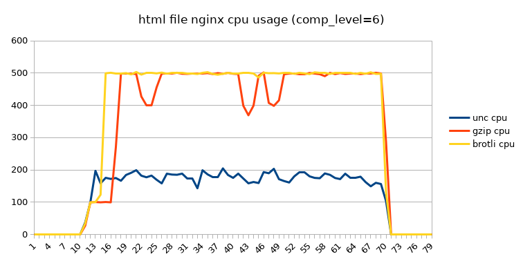
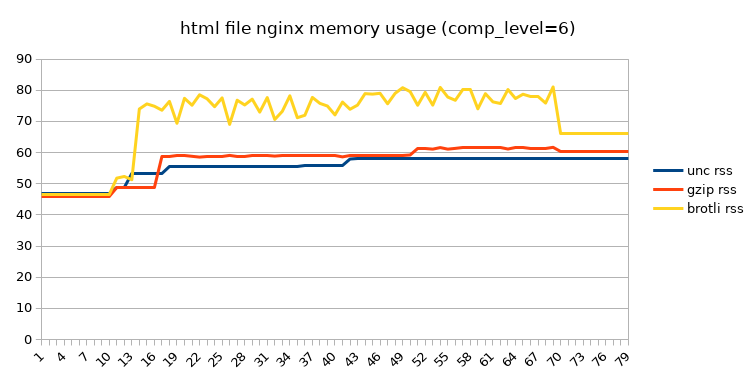
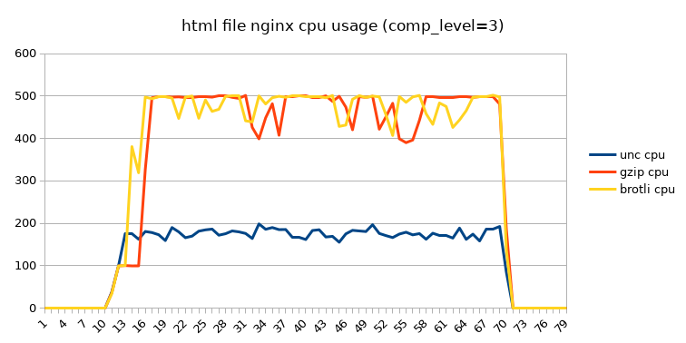
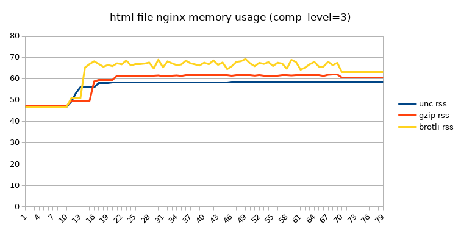
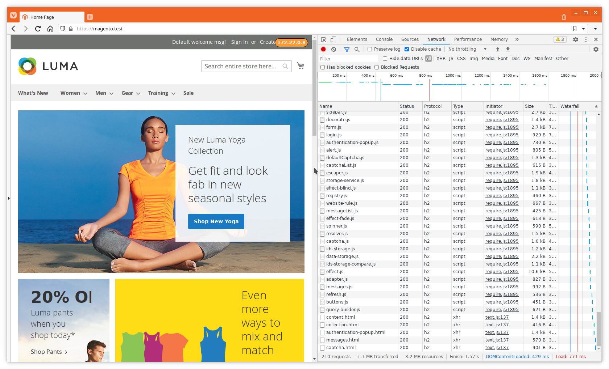

Most webbrowsers support brotli for a while now, but outside the big players
it's not so widely adopted, or so it seems. Once you start looking outside the
really big websites and sites not behind something like CloudFlare, there's not
that many responses with brotli compressed.

<!--more-->

## Some brotli facts

The specification is described in [RFC7932][1].

These days most browsers support it and so your `Accept-Encoding` request
header usually looks like:

```
accept-encoding: gzip, deflate, br
```

Fun fact: browsers only add `br` if https is used, this is just a convention
because brotli compression works just fine with plain http.

> The reason to limit brotli to secure contexts is that intermediaries
> (specifically, buggy proxies and content scanners) tend to behave very poorly
> when they encounter non-deflate/gzip Content-Encoding. The Google guys
> discovered this when they rolled out ‘sdch’ and ‘bzip2’ before that; they
> ended up pulling bzip2 partly for that reason and sdch has a number of hacks
> that they had to put in. By requiring HTTPS for brotli, they can head off
> this problem in most cases because comparatively few content-scanners MITM
> HTTPS streams

Quoted from Eric Lawrence comment on
[Better than Gzip Compression with Brotli][2].

The potential overhead of using brotli to compress serverside and decompress
client side should be outweighed by the reduced time over the wire because
there will be less data to transfer.

## Setup nginx with brotli

On some platforms adding brotli support to Nginx can be a bit of a hassle
because there are no precompiled binaries available. But when using Alpine
Linux or Arch Linux it is easy, just install the brotli module for Nginx and
you are good to go.

In this test Alpine Linux will be used. To install nginx with brotli:

```sh
apk add --no-cache \
    nginx \
    nginx-mod-http-brotli
```

For this test we'll globally configure gzip and brotli by adding 2 globally
included files in `/etc/nginx/http.d`. This is somewhat different in Alpine
Linux compared to others, where you would place the config files in
`/etc/nginx/conf.d`.

gzip configuration:

```nginx
gzip on;

gzip_comp_level 6;
gzip_buffers 16 8k;
gzip_proxied any;
gzip_types
    text/plain
    text/css
    text/js
    text/xml
    text/javascript
    application/javascript
    application/x-javascript
    application/json
    application/xml
    application/xml+rss
    image/svg+xml;
gzip_vary on;
```

brotli configuration:

```nginx
brotli on;

brotli_comp_level 6;
brotli_buffers 16 8k;
brotli_types
    text/plain
    text/css
    text/js
    text/xml
    text/javascript
    application/javascript
    application/x-javascript
    application/json
    application/xml
    application/xml+rss
    image/svg+xml;
```

With the config files in place, lets check a fairly large
[index.html](./test.html) file with curl.

```sh
#!/usr/bin/env bash
curl --insecure \
  -so/dev/null \
  -D- \
  https://brotli.test/index.html
curl --insecure \
  -so/dev/null \
  -H 'Accept-encoding: gzip' \
  -D- \
  https://brotli.test/index.html
curl --insecure \
  -so/dev/null \
  -H 'Accept-encoding: br' \
  -D- \
  https://brotli.test/index.html
```

```
HTTP/2 200
server: nginx
date: Thu, 25 Mar 2021 10:41:06 GMT
content-type: text/html; charset=UTF-8
content-length: 1801601
last-modified: Wed, 24 Mar 2021 15:07:26 GMT
vary: Accept-Encoding
etag: "605b55ae-1b7d81"
accept-ranges: bytes

HTTP/2 200
server: nginx
date: Thu, 25 Mar 2021 10:41:06 GMT
content-type: text/html; charset=UTF-8
last-modified: Wed, 24 Mar 2021 15:07:26 GMT
vary: Accept-Encoding
etag: W/"605b55ae-1b7d81"
content-encoding: gzip

HTTP/2 200
server: nginx
date: Thu, 25 Mar 2021 10:41:06 GMT
content-type: text/html; charset=UTF-8
last-modified: Wed, 24 Mar 2021 15:07:26 GMT
vary: Accept-Encoding
etag: W/"605b55ae-1b7d81"
content-encoding: br
```

This tells us both gzip and brotli work. And in the nginx log the response size
difference is pretty obvious:

```
172.22.0.1 - - [25/Mar/2021:10:41:06 +0000] "GET /index.html HTTP/2.0" 200 1801601 "-" "curl/7.75.0" "-"
172.22.0.1 - - [25/Mar/2021:10:41:06 +0000] "GET /index.html HTTP/2.0" 200 18250 "-" "curl/7.75.0" "-"
172.22.0.1 - - [25/Mar/2021:10:41:06 +0000] "GET /index.html HTTP/2.0" 200 4166 "-" "curl/7.75.0" "-"
```

The gzipped content is about 1% of the original size that has to be transferred
over the wire, but the brotli response is only 20% of the gzipped content, and
compared to the original 0.2%. So for mostly text brotli clearly compresses way
better.

## Compare cpu and memory usage of Nginx (the test)

[wrk][3] will be used to generate some traffic and by using [psrecord][4] the
cpu and memory usage will be tracked.

The test will be run in the following steps:

- start nginx
- start psrecord and record for 80s
- wait 10s
- start wrk with 5 connections, 1 threads for 60s
- wait 10s for psrecord to finish
- stop nginx

```sh
#!/usr/bin/env bash

log_date="$(date +%Y%m%d%H%M%S)"
pid_nginx="$(pgrep nginx | head -n1)"

if [ -z "$1" ]; then
  psrecord \
    --log "nginx-htmlfile.uncompressed.psrecweb.$log_date.log" \
    --include-children \
    --interval 1 \
    --duration 80 \
    "$pid_nginx" &
else
  psrecord \
    --log "nginx-htmlfile.$1.psrecweb.$log_date.log" \
    --include-children \
    --interval 1 \
    --duration 80 \
    "$pid_nginx" &
fi

sleep 10
if [ -z "$1" ]; then
  wrk -c 5 -t 1 -d 60s \
    "https://brotli.test/index.html" \
    > "nginx-htmlfile.uncompressed.wrk.$log_date.log" 2>&1
else
  wrk -c 5 -t 1 -d 60s \
    -H "Accept-Encoding: $1" \
    "https://brotli.test/index.html" \
    > "nginx-htmlfile.$1.wrk.$log_date.log" 2>&1
fi
sleep 10
```

## Compare cpu and memory usage of Nginx (comp_level=6)

Wrk result uncompressed:

```
Running 1m test @ https://brotli.test/index.html
  1 threads and 5 connections
  Thread Stats   Avg      Stdev     Max   +/- Stdev
    Latency     8.10ms    1.61ms  23.49ms   79.96%
    Req/Sec   615.71     81.90   787.00     71.71%
  36833 requests in 1.00m, 61.81GB read
Requests/sec:    612.86
Transfer/sec:      1.03GB
```

Wrk result gzipped:

```
Running 1m test @ https://brotli.test/index.html
  1 threads and 5 connections
  Thread Stats   Avg      Stdev     Max   +/- Stdev
    Latency    20.01ms    9.25ms  81.44ms   91.67%
    Req/Sec   259.59     66.53   373.00     81.83%
  15522 requests in 1.00m, 274.53MB read
Requests/sec:    258.51
Transfer/sec:      4.57MB
```

Wrk result brotli:

```
Running 1m test @ https://brotli.test/index.html
  1 threads and 5 connections
  Thread Stats   Avg      Stdev     Max   +/- Stdev
    Latency     9.94ms    3.93ms  40.33ms   93.22%
    Req/Sec   518.84    116.14   700.00     80.17%
  31002 requests in 1.00m, 132.04MB read
Requests/sec:    516.41
Transfer/sec:      2.20MB
```

Nginx cpu usage:



Nginx memory usage:



## Compare cpu and memory usage of Nginx (comp_level=3)

Wrk result uncompressed:

```
Running 1m test @ https://brotli.test/index.html
  1 threads and 5 connections
  Thread Stats   Avg      Stdev     Max   +/- Stdev
    Latency     8.10ms    1.61ms  23.49ms   79.96%
    Req/Sec   615.71     81.90   787.00     71.71%
  36833 requests in 1.00m, 61.81GB read
Requests/sec:    612.86
Transfer/sec:      1.03GB
```

Wrk result gzipped:

```
Running 1m test @ https://brotli.test/index.html
  1 threads and 5 connections
  Thread Stats   Avg      Stdev     Max   +/- Stdev
    Latency    15.84ms    6.98ms  77.51ms   91.05%
    Req/Sec   327.32     78.45   444.00     85.00%
  19568 requests in 1.00m, 2.04GB read
Requests/sec:    325.88
Transfer/sec:     34.71MB
```

Wrk result brotli:

```
Running 1m test @ https://brotli.test/index.html
  1 threads and 5 connections
  Thread Stats   Avg      Stdev     Max   +/- Stdev
    Latency     8.07ms    3.03ms  37.26ms   88.97%
    Req/Sec   633.27    119.74     0.88k    84.17%
  37848 requests in 1.00m, 167.48MB read
Requests/sec:    630.41
Transfer/sec:      2.79MB
```

Nginx cpu usage:



Nginx memory usage:



## Real life application: Magento

Since Magento also uses woff2 font's, the nginx gzip and brotli config must be extended so those are also gzipped or brotli compressed when requested.

gzip configuration:

```nginx
gzip on;

gzip_comp_level 6;
gzip_buffers 16 8k;
gzip_proxied any;
gzip_types
    font/woff2
    image/svg+xml
    text/css
    text/html
    text/javascript
    text/js
    text/plain
    text/xml
    application/font-woff2
    application/javascript
    application/json
    application/x-font-woff
    application/x-javascript
    application/xml
    application/xml+rss;
gzip_vary on;
```

brotli configuration:

```nginx
brotli on;

brotli_comp_level 6;
brotli_buffers 16 8k;
brotli_types
    font/woff2
    image/svg+xml
    text/css
    text/html
    text/javascript
    text/js
    text/plain
    text/xml
    application/font-woff2
    application/javascript
    application/json
    application/x-font-woff
    application/x-javascript
    application/xml
    application/xml+rss;
```

To test the different scenario's, start without any gzip or brotli config, then
gzip only and as last brotli only. Then a comparison can be made how the
requests behaved.

Magento homepage (no compression):


Magento homepage (gzip compression):



Magento homepage (brotli compression):


## Conclusion

Looking at the plain html file results, if you have unlimited bandwidth on both
sides, don't use compression. Once compression is used the cpu usage rises a
lot higher compared to no compression. Brotli seems to outperform gzip quite a
bit in these tests.  The memory usage of Nginx when using brotli goes higher,
so on a larger scale this will definitly have some impact there. The data
transferred over the wire is massively less when brotli is used, even compared
to gzip. When de compression level is reduced the throughput using brotli is
higher than uncompressed, still at a higher cpu cost but the memory usage
difference is a lot lower.

Looking at the results of the Magento test, the difference between gzip and
brotli are not that huge anymore. When the page contains different types of
content there is only a small 10% difference between the transferred data with
gzip vs brotli.  In this scenario, the brotli compressed page, js, css seems to
be a bit faster to render in our browser.

Brotli compression is definitly worth to be enabled. Even if there is only a
gain of 10% less network traffic in the case of a real life Magento page. Once
the number of requests rise this gain is significant. On the server site there
is a need for a bit more memory, but its not that extreme. All in all Brotli is
a nice addition if you can implement it.

[1]: https://tools.ietf.org/html/rfc7932
[2]: https://hacks.mozilla.org/2015/11/better-than-gzip-compression-with-brotli/
[3]: https://github.com/wg/wrk
[4]: https://github.com/astrofrog/psrecord
