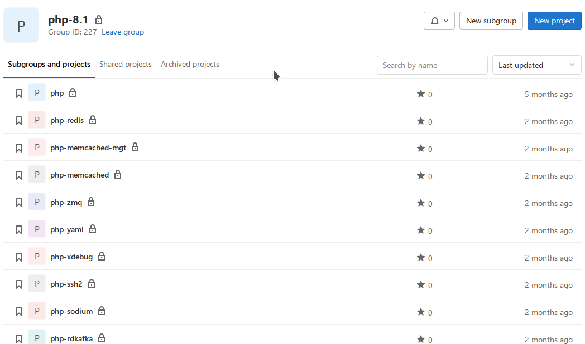
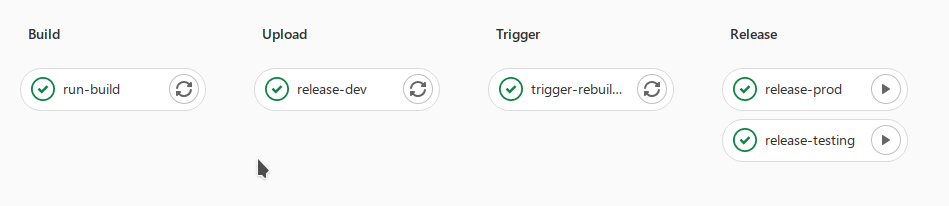
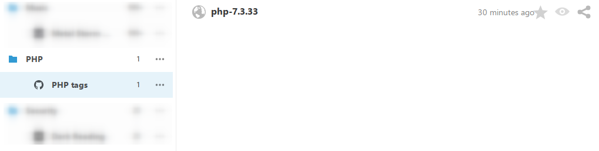
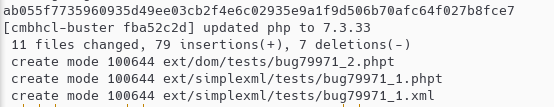
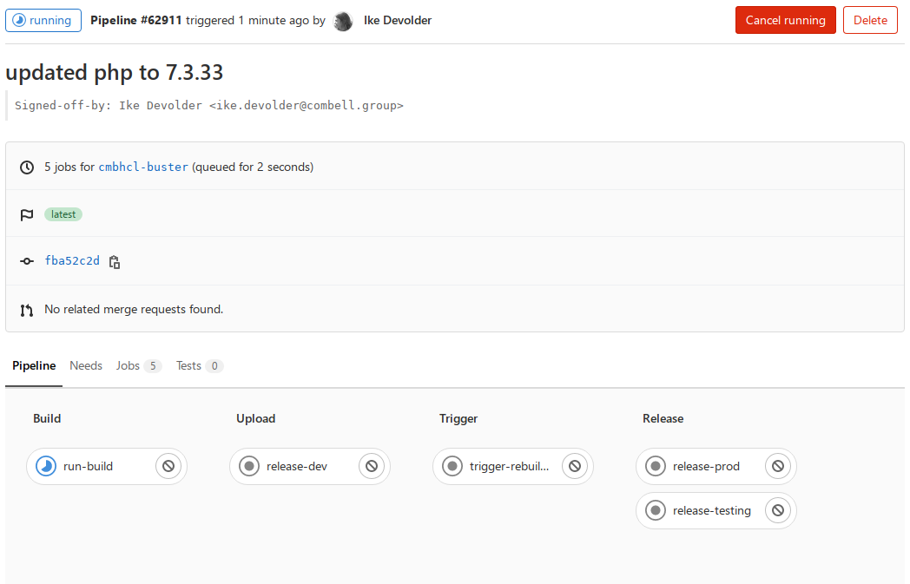

How do we at Combell go from a release by the PHP maintainers to a deploy on
production machines? How involved is such an update and can we go fast if it is
really needed.

<!--more-->

Our structure
-------------

For every PHP version we support on our platform, we have a packages group in
gitlab. There there is a repo for the PHP source and the extensions we support
for customers or use internally.



When a new version of PHP is on the horizon, like now with PHP 8.1, we start
building fairly early Alpha versions to see if something is changed we need to
address. Only when the RC's start popping up we start to verify if the
extensions we want to offer work with this new version. We usually find some
things in the extensions, but it is amazing how many people already have worked
to make patches available for these extensions to make them build/work with the
upcoming PHP release.

Our platform is based on Debian and so we have debian repositories to
distribute our custom packages easily. The building process works with the
`dev` repo. Once everything is ok and built in `dev` we can also make packages
available in `testing` and eventually in `production` repo. So if there is
something wrong somewhere in the line we can't accidentally install broken
packages on production systems. The release to `testing` and `production` are
manual jobs after some verification.



On the shared hosting platform we have a distinct difference between 'web'
nodes and 'ssh' nodes. The web nodes get their updates via `apt` updates and
the `php-fpm` processes are reloaded after the update. This makes sure there is
no visible service interruption during updates. The ssh nodes get their updates
via a container image, so long running processes need to be restarted, but
regular ssh sessions just get the latest versions available on a new login.

The update flow
---------------

For PHP releases usually we use the moment tags are set in the
[php-src](https://github.com/php/php-src) repo as the moment to fetch the
updated sources and start building. Depending on other factors the news item
causes me to update the PHP package repo's somewhere on wednesday before the
official release announcement.



There is a system in place that will automatically update the sources after the
release announcements on [php.net](https://www.php.net) in case the tag was
missed, but usually I do the updates manually the day before.



When the updates are pushed those are built automatically and all extensions
get triggered to make sure everything is fine there.



When the builds are ok and verified, the update of the container images for the
'ssh' nodes is triggered, so normally our customers get the new released on
thursday morning, which is normally the day PHP versions are released to the
public with an announcement on [php.net](https://www.php.net). The updates of
the web nodes is triggered on `AWX` (Ansible Tower) and there the update jobs
are executed on the target machines.

```sh
awx \
    job_templates \
    launch 123 \
    --job_tags "php-init,php,php-upgrade" \
    --extra_vars '{"apt_state": "latest","reload_httpd_and_phpfpm": true}' \
    --limit 'web'
```

In case of emergency
--------------------

PHP has a very stable release flow and is super reliable on that front. But if
there is a serious issue where we really need to patch fast it is important to
know how quickly we can go from source update to production.

- build time ~5 min (average taken from our 8.1 rc builds)
- release in dev repo 30 sec
- wait for triggers ~10 min (worst case)
- release all related packages in testing and production repos ~10 min
- updates
    - ssh
        - build image ~15 min
        - pull updated images on all machines (65 at the time of writing) ~15 min
    - web
        - awx php update run for 100 machines ~30 min

All together we could if needed do an emergency update in around 2 hours if
needed. For normal updates it will be longer since the update runs are spread
out over a longer time period.

Conclusion
----------

In general our flow gives us the possibility to deliver PHP updates on release
date for our customers. We have been able to deliver this promise for over 2
years now. We also have been able to provide test versions of the upcoming
major PHP releases since 8.0. There we offered 8.0 alpha 1 without extensions
for customers, now for the PHP 8.1 release we have been offering 8.1 since RC1
with all extensions we usually provide available for testing.

Personally I'm very happy that we can easily keep up. We also must thank all
PHP contributors and extension creators for all their hard work to make PHP
awesome. A special shout out should go to
[Remi Collet](https://twitter.com/RemiCollet) and
[Ondřej Surý](https://twitter.com/oerdnj) who are providing PHP packages and an
insane number of extensions for users of the larger linux distributions out
there. We don't use the packages they provide, but their work makes it easier
for everyone.
