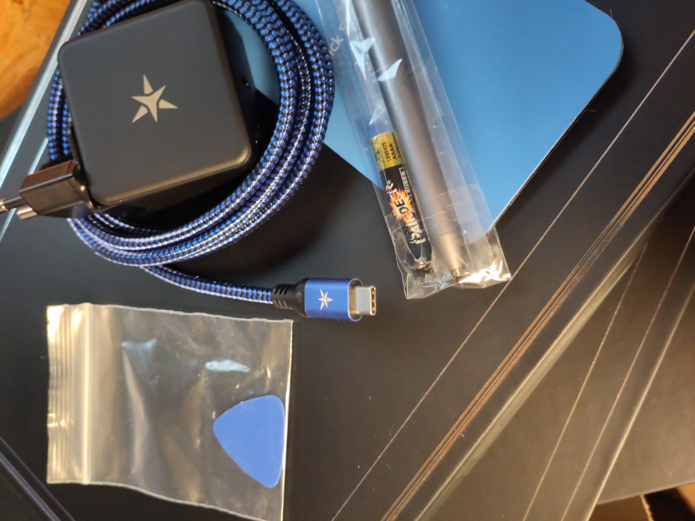
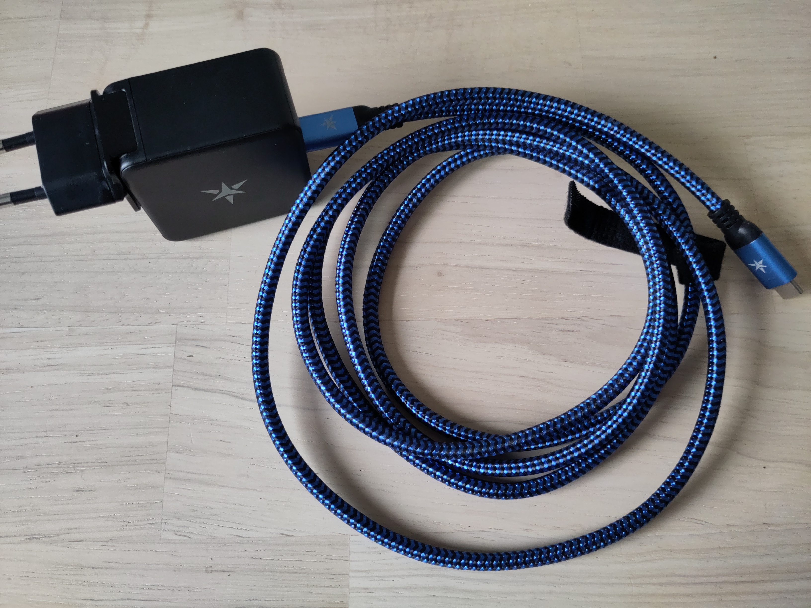
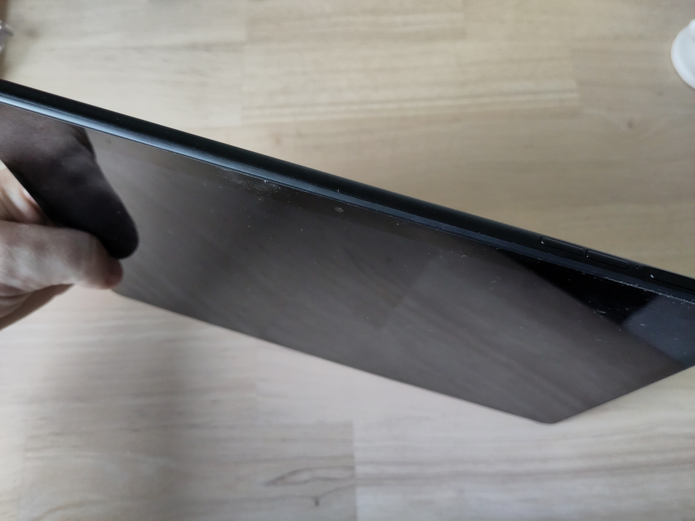
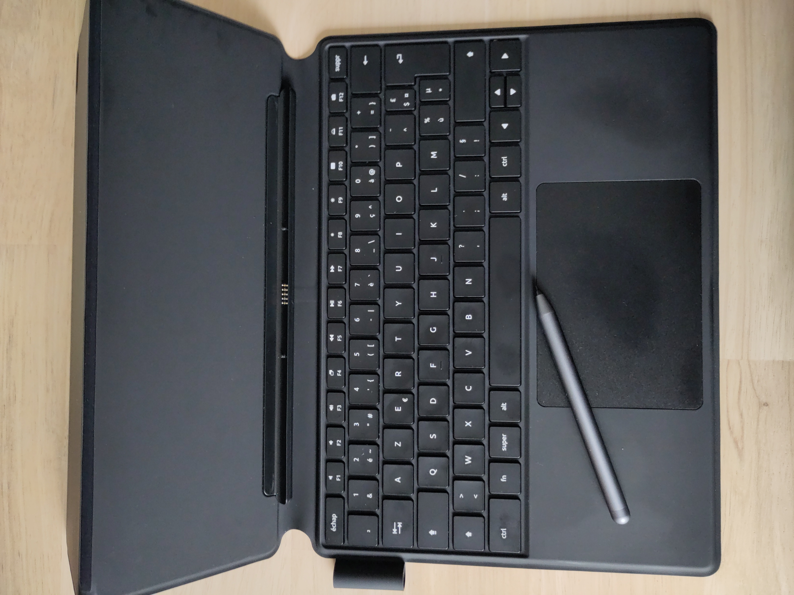
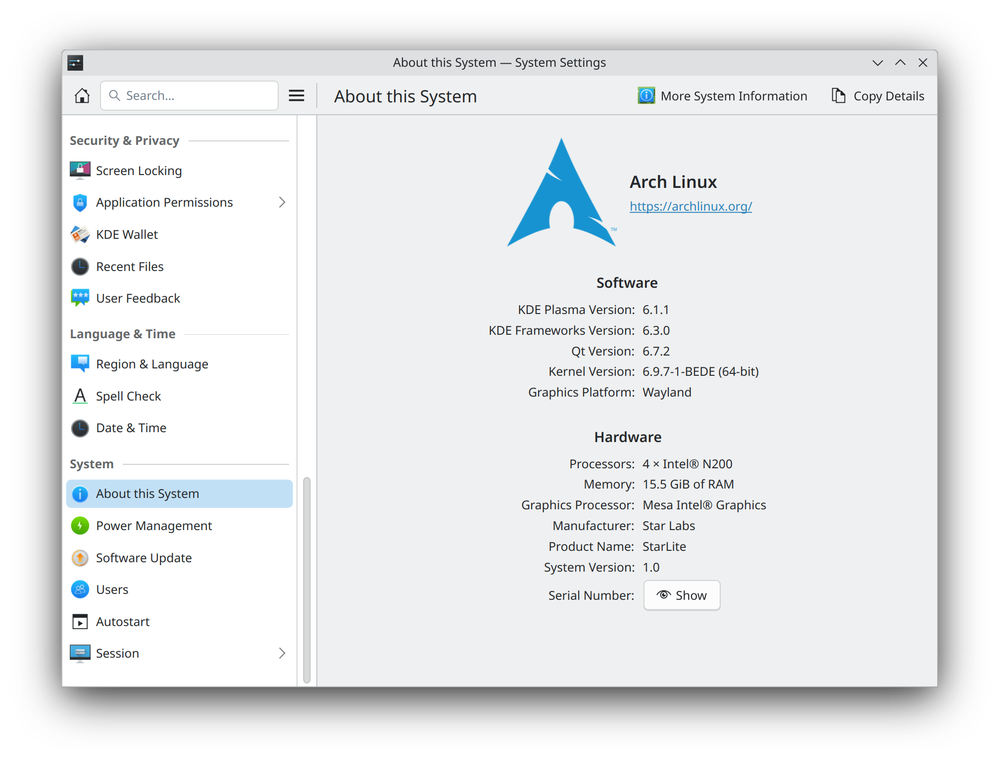

Recently I received my Starlite MK V Linux tablet / laptop.

<!--more-->



## Content





When I ordered the Starlite, I also added the keyboard and the stylus pen. I wanted to have the option to use this device like a laptop so the keyboard comes in handy. The stylus is just something extra, I really want to know how drawing on a Linux tablet will feel, and the kids will probably like it :).



## First run

I ordered it with Ubuntu preinstalled since I thought that would be a safe bet. Well it looks like I have no idea how to use Ubuntu anymore. First the good part, everything that was installed worked fine. The on-screen keyboard showed up, automatic screen rotation went smooth. The initial configuration went well and I could log-in to Ubuntu. But when I installed krita to go and test drawing something with the stylus, things did not work so well. Krita did not even start. Since I did not really plan on using Ubuntu anyway I did not even bother trying to figure out what went wrong.

## Setting up Arch Linux with Plasma Desktop

Since this is an actual PC, installation of Arch Linux works fine. Via the boot menu I got to boot the Arch Linux ISO from a USB-stick. Using a script I installed Plasma Desktop as I would on any other computer. Since this will be about additional steps I had to take to make the tablet behave like a tablet I will not go into depth how to install Arch Linux, there are plenty of good resources for that. For the installation the keyboard came in handy, since I would probably not have been able to boot from USB and do a text based install without it.



### On-screen keyboard

Since I'm using Plasma Desktop, `maliit-keyboard` is stated to be the best choice for the on-screen keyboard. I actually prepared my install script to install it already, but manual installation would be done with `pacman -S maliit-keyboard`. SDDM also needs to run on wayland to be able to use the on-screen keyboard. For this to work I added a extra config file `/etc/sddm.conf.d/plasma-wayland.conf` with the following content

```
[General]  
DisplayServer=wayland  
GreeterEnvironment=QT_WAYLAND_SHELL_INTEGRATION=layer-shell  
  
[Wayland]  
CompositorCommand=kwin_wayland --drm --no-global-shortcuts --no-lockscreen --locale1 --inputmethod maliit-keyboard
```

I had to add `--inputmethod maliit-keyboard` to get support for the on-screen keyboard.
With the default SDDM theme I had to touch the input language dropdown for the maliit-keyboard to show up. Once I started using the Breeze theme in SDDM it immediatly started showing up when I pressed the password field.

### Auto rotation of the display

At this point the tablet only works in landscape mode, there is no automatic rotation yet. To get this working I needed to install `iio-sensor-proxy`: `pacman -S iio-sensor-proxy`. After installing and a reboot the auto rotation started to work on both login screen and the desktop.

### Desktop in action

Below is a quick video recording of the desktop in action with on-screen keyboard and auto rotation of the display.



## Chromium based browsers

Since I'm normally using Vivaldi, I searched a bit how to get the on-screen keyboard popping up. By default none of the Chromium based browsers trigger the on-screen keyboard and by not doing that become pretty useless when in tablet mode.

To get the on-screen keyboard working I had to add the following flags to Vivaldi (I'm going to assume other chromium based browsers will need the same flags):

```
--ozone-platform-hint=auto
--ozone-platform=wayland
--enable-wayland-ime
```

## maliit-keyboard tweaks

Set the theme to `Breeze` to integrate properly with Plasma Desktop.

```sh
gsettings set org.maliit.keyboard.maliit theme Breeze
```

I like to see a bit of the underlying screen when the keyboard pops up. Maliit-keyboard allows opacity.

```sh
gsettings set org.maliit.keyboard.maliit opacity 0.8
```

To allow input for other languages we can set possible languages via the settings. I have not yet found how to change the keyboard layout for maliit-keyboard yet.

```sh
gsettings set org.maliit.keyboard.maliit enabled-languages "['en', 'nl']"
```

Because the auto capitalization did not really behave as I expected. I got it disabled.

```sh
gsettings set org.maliit.keyboard.maliit auto-capitalization false
```

To get a graphical interface for these settings you can install `dconf-editor`.

## General impression

### My requirements

Since the impression of the device and how the software works depends on your personal requirements, I'll list mine here.

I wanted to have a very portable device, where I can comfortably browse the web, handle some email and read a paper or a book. Additionally I want to be able to remotely login into another system with ssh or a remote desktop.

Writing a document was not really my first requirement, but taking some notes is interesting.

As and extra because it is a tablet after all and I ordered the stylus, letting the kids draw something on it would be cool.

### Pros

- It is a PC, so you can install all your favorite applications and have no learning curve
- The 12 inch form-factor makes it very portable
- I love the possibility to use it as tablet, or with the keyboard/touch-pad
- The battery life is pretty good compared to a laptop

### Cons

- The touch-pad does not properly disable while typing which leads to many accidental clicks while typing
- The keyboard with stand has more depth than a laptop, so no comfortable use of a laptop pillow in the sofa
- Maliit-keyboard only had qwerty layout, it conflicts a bit with my default azerty layout

### Annoyances

- Maliit-keyboard sometimes refuses to show, or the other way around to go away
- Applications in XWayland don't always work so great with the on-screen keyboard

## Conclusion

I like the Starlite MK V, it suits my needs pretty good and will over time replace a lightweight laptop and an aging Android tablet. For tasks on the go it will come in handy. The keyboard with stand makes it handy to do some productivity tasks. The tablet mode makes it great for consuming media, books, papers, ...

Overall I'm also impressed by how well everything already works with a touch-only interface (once installed). But compared to for example Android there are still some rough edges. Nothing outside of my expectation, I was expecting the need for some tweaking so it is fine for my use. But it is probably not yet for the general audience.

So I like my current setup of the Starlite and looking forward to improve it further, after only one week since receiving it's looking good.
